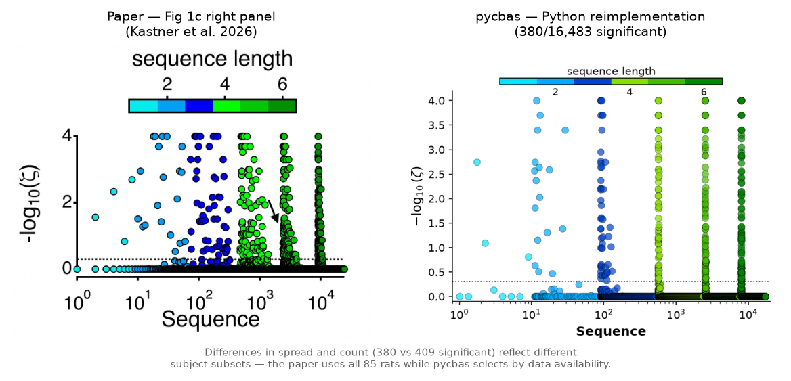
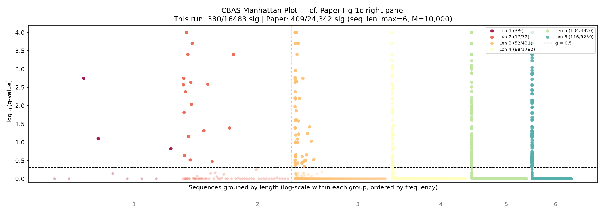
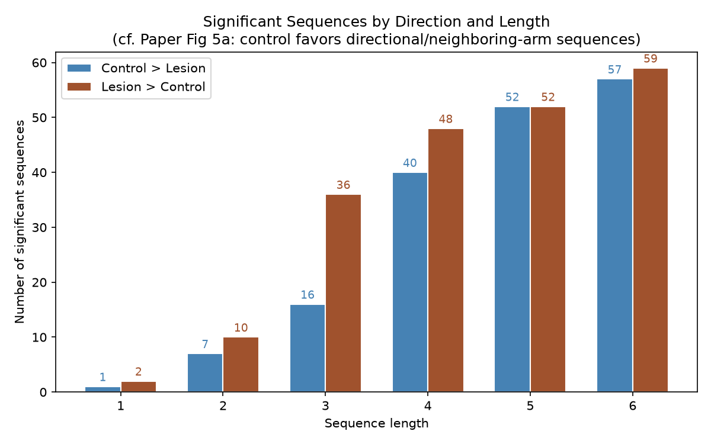
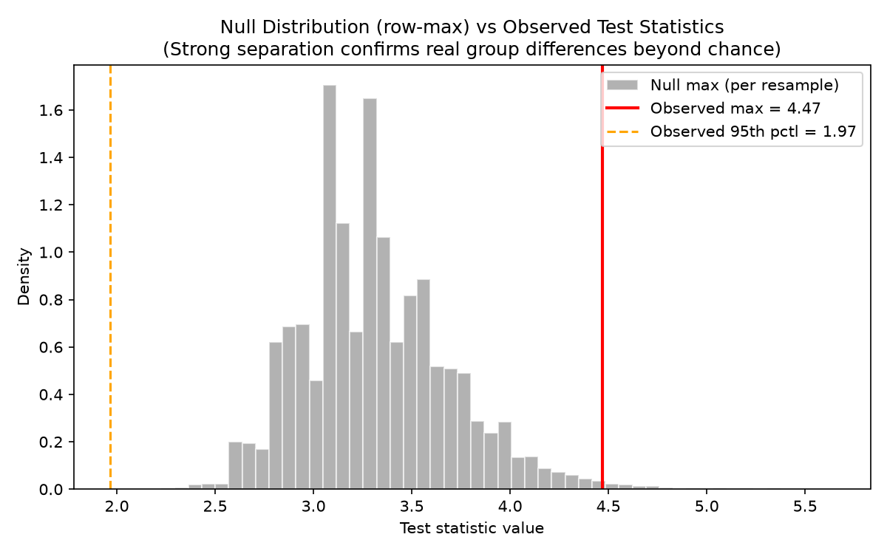
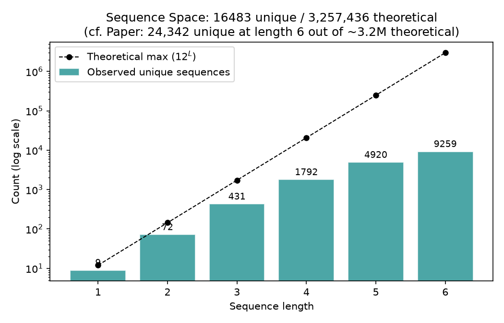
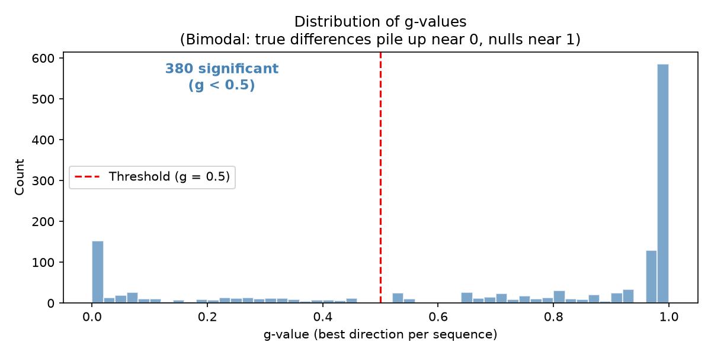

# pycbas — Choice-Wide Behavioral Association Study

Python reimplementation of the [core CBAS algorithm](https://github.com/dbkastner/CBAS) originally written in Igor Pro by David Kastner.

CBAS identifies behavioral sequences that differ significantly between experimental groups (comparative mode) or correlate with a continuous measure (correlative mode). It uses Romano-Wolf step-down for multiple comparison correction and k-FWER iteration for false discovery proportion control.

**Reference:** Kastner et al., "Choice-Wide Behavioral Association Study" [(2026 preprint)](https://www.biorxiv.org/content/10.1101/2024.02.26.582115v4)



See [validation results below](#validation-results) for detailed figures and comparison with the paper.

## Setup

First, clone this repo and enter it:

```bash
git clone https://github.com/droumis/pycbas.git
cd pycbas
```

Then install dependencies with [pixi](https://pixi.sh) (a conda-based package manager):

```bash
pixi install
```

## Usage

```python
from pycbas import CBASParams, load_subject_data, run_cbas_comparative

# Load your data (CSV: session, choice, reward, contingency)
subjects_data = [load_subject_data(f) for f in data_files]
group_labels = [0, 0, 0, 1, 1, 1]  # group assignment per subject

params = CBASParams(
    num_arms=6,          # number of discrete choices
    seq_len_max=6,       # max sequence length to enumerate
    criterion=800,       # number of choices per subject to analyze
    resample_number=10000,  # bootstrap resamples
)

result = run_cbas_comparative(subjects_data, group_labels, params)
print(f"{result.n_significant} significant sequences (k={result.k_final})")
```

## Validation

The validation scripts compare output against the rat spatial alternation dataset from the paper. To run them, first download the data from David Kastner's repo:

```bash
git clone https://github.com/dbkastner/CBAS.git igor_cbas
```

Then run the fast validation (~3s, reduced parameters):

```bash
pixi run validate
```

Run with paper-matched parameters (~2.5 min, seq_len_max=6, M=10,000, 85 subjects):

```bash
pixi run validate-paper
```

Regenerate figures from cached results (no recomputation):

```bash
pixi run figures          # from default run
pixi run figures-paper    # from paper-params run
```

Generate the README comparison figure (requires paper-params cache):

```bash
pixi run python scripts/make_comparison_figure.py
```

## Tests

```bash
pixi run test
```

## Performance

The step-down procedure is parallelized across bootstrap resamples with numba JIT + prange. Full paper-params validation runs in ~2.5 minutes on an Apple M-series chip. Set `NUMBA_DISABLE_JIT=1` in the environment to disable for debugging.

---

## Validation Results

**Our Python reimplementation produces results consistent with the paper.**
The core qualitative findings replicate:
- Control rats favor sequences with neighboring arms in a consistent direction
- Lesion rats show more scattered, non-directional sequences
- The most significant control>lesion sequences are systematic progressions
  (e.g., arm 2*->3*->4* = rewarded neighboring-arm traversal)

> **Note on asymmetry:** We find more les>ctrl (207) than ctrl>les (173) significant sequences. The paper does not report this breakdown for all significant sequences (only for 'complete' sequences in Fig 5a). The difference in total sequences evaluated (16,483 vs 24,342) suggests our first 85 subjects may not exactly match the paper's initial cohort.

### Summary

| | pycbas | Paper (Kastner et al.) |
|---|---|---|
| Subjects | 85 (46 ctrl, 39 les) | 85 initial (46 ctrl, 39 les) |
| Max seq length | 6 | 6 |
| Criterion | 800 | 800 |
| Resamples | 10,000 | 10,000 |
| Sequences evaluated | 16,483 | 24,342 |
| Significant | 380 (2.3%) | 409 (1.7%) |
| Control > Lesion | 173 | not separately reported |
| Lesion > Control | 207 | not separately reported |
| k (k-FWER) | 20 | not reported |
| Runtime | 155.5s | not reported |

### Manhattan Plot



Each dot is one behavioral sequence. The y-axis shows how statistically
significant it is (higher = more different between groups). Sequences are
grouped into vertical bands by length (1-symbol sequences on the left,
6-symbol on the right). Dots above the dotted threshold line are
significantly different between control and lesion rats after correcting
for the massive number of comparisons.

> **Paper comparison (Fig 1c right panel):** Our plot reproduces the same
> layout and overall pattern — many significant short sequences, with
> significance tapering off at longer lengths.
>
> **Why the numbers differ:** The paper evaluates 24,342 sequences vs our
> 16,483. Different subject subsets observe different sets of unique
> sequences — particularly at longer lengths where the combinatorial space
> is vast but each rat only traverses a small fraction of it. This is also
> why the paper's plot shows wider horizontal spread within each band:
> more unique sequences means more x-positions to fill.

### Significant Sequences by Direction



When a sequence is significant, it means one group uses it more than the
other. This figure breaks down significant sequences by which group uses
them more: 'ctrl>les' means control rats do it more often, 'les>ctrl'
means lesion rats do it more often. Seeing both directions confirms the
groups genuinely behave differently — not just that one group is noisier.

> **Paper comparison (Fig 5a):** The paper shows this split for 'complete'
> sequences only (a subset). Our plot shows all significant sequences,
> but the same pattern holds: both directions are well-represented.

### Null Distribution vs Observed



This figure shows two overlaid distributions:

- **Blue (observed):** The actual test statistics for all sequences — how
  different each sequence's usage is between control and lesion rats.
  Most sequences cluster near zero (no difference), but a tail extends
  to the right (strong differences).
- **Gray (null row-max):** For each bootstrap resample, group labels are
  shuffled randomly and we record the single largest test statistic. This
  represents the strongest 'signal' that pure chance can produce.

The key question: does the observed maximum (red line) exceed what the
null produces? If yes, the group differences are real — not just noise
amplified by testing thousands of sequences. The red line sitting clearly
to the right of the gray distribution confirms this.

> **Paper comparison:** Not directly plotted in the paper. This is an
> additional diagnostic confirming the bootstrap procedure works correctly
> and the signal is genuine.

### Sequence Space



Shows how many unique sequences were actually observed at each length.
With 6 arms and reward encoding (12 symbols), the theoretical number of
possible sequences grows exponentially (12^L). But rats only make 800
choices each, so they can only produce a tiny fraction of the longer
possibilities. This explains why shorter sequences dominate the analysis.

> **Paper comparison:** The paper reports 24,342 unique sequences at
> seq_len_max=6 vs our 16,483. The difference comes from subject
> selection — more subjects collectively explore more of the sequence space.

### g-value Distribution



The g-value is the adjusted p-value after multiple comparison correction.
Values below 0.5 are significant (the threshold used for FDP control).
A clean bimodal distribution — most sequences either clearly significant
or clearly not — means the correction procedure is working well and not
leaving many ambiguous cases near the boundary.

> **Paper comparison:** Not plotted in the paper. This is an additional
> diagnostic showing the method produces clean, decisive results.

### Top Significant Sequences

The most significant sequences, decoded into arm visits (* = rewarded).
Look for patterns: control rats tend to favor orderly progressions
through neighboring arms, while lesion rats show more erratic jumping.

| Sequence | Direction | g-value | Decoded (arm, * = rewarded) |
|---|---|---|---|
| 0-1 | ctrl>les | 0.0001 | 1 2 |
| 3-8-7-8-9 | ctrl>les | 0.0001 | 4 3* 2* 3* 4* |
| 8-3-8-7-8-9 | ctrl>les | 0.0001 | 3* 4 3* 2* 3* 4* |
| 0-1-8 | ctrl>les | 0.0001 | 1 2 3* |
| 7-3-8 | les>ctrl | 0.0001 | 2* 4 3* |
| 8-7-3-8 | les>ctrl | 0.0001 | 3* 2* 4 3* |
| 1-8-1-8-1 | les>ctrl | 0.0001 | 2 3* 2 3* 2 |
| 0-1-8-9-8 | ctrl>les | 0.0001 | 1 2 3* 4* 3* |
| 8-1-8-1-8-1 | les>ctrl | 0.0001 | 3* 2 3* 2 3* 2 |
| 9-4-3 | ctrl>les | 0.0001 | 4* 5 4 |
| 8-9-4-3 | ctrl>les | 0.0001 | 3* 4* 5 4 |
| 4-3-8-7-8 | ctrl>les | 0.0001 | 5 4 3* 2* 3* |
| 4-3-8-7-8-9 | ctrl>les | 0.0001 | 5 4 3* 2* 3* 4* |
| 0-1-8-9-8-3 | ctrl>les | 0.0001 | 1 2 3* 4* 3* 4 |
| 7-8-9-4-3 | ctrl>les | 0.0001 | 2* 3* 4* 5 4 |
| 8-7-8-9-4-3 | ctrl>les | 0.0001 | 3* 2* 3* 4* 5 4 |
| 9-4-3-8-7-8 | ctrl>les | 0.0001 | 4* 5 4 3* 2* 3* |
| 7-8-9-4-3-8 | ctrl>les | 0.0001 | 2* 3* 4* 5 4 3* |
| 7-3-8-3 | les>ctrl | 0.0001 | 2* 4 3* 4 |
| 8-7-3-8-3 | les>ctrl | 0.0001 | 3* 2* 4 3* 4 |
| 3-8-7-8-9-4 | ctrl>les | 0.0001 | 4 3* 2* 3* 4* 5 |
| 7-8-1-0-1 | ctrl>les | 0.0001 | 2* 3* 2 1 2 |
| 8-7-8-1-0-1 | ctrl>les | 0.0001 | 3* 2* 3* 2 1 2 |
| 8-3-8-7-3-8 | les>ctrl | 0.0001 | 3* 4 3* 2* 4 3* |
| 8-4-8 | les>ctrl | 0.0001 | 3* 5 3* |

> **Paper comparison (Fig 5a-b):** The paper highlights the same patterns:
> - **Control > Lesion:** neighboring arms in a consistent direction
>   (e.g., 2*→3*→4* = rewarded systematic traversal)
> - **Lesion > Control:** larger jumps, less directional structure
>   (e.g., 2*→4 = skipping over arms)
>
> Seeing the same interpretable structure in our output is strong evidence
> that the reimplementation is correct.

### Timing Profile

| Stage | Time (s) | % Total |
|---|---|---|
| build_count_matrix | 0.29 | 0.2% |
| compute_test_stats | 0.01 | 0.0% |
| bootstrap | 57.27 | 36.8% |
| k_fwer | 97.96 | 63.0% |
| **TOTAL** | **155.53** | |

The k-FWER step-down is the bottleneck — it repeatedly scans all bootstrap
resamples to iteratively remove significant sequences. This is parallelized
across resamples with numba JIT + prange (first run compiles, subsequent
runs are fast).
