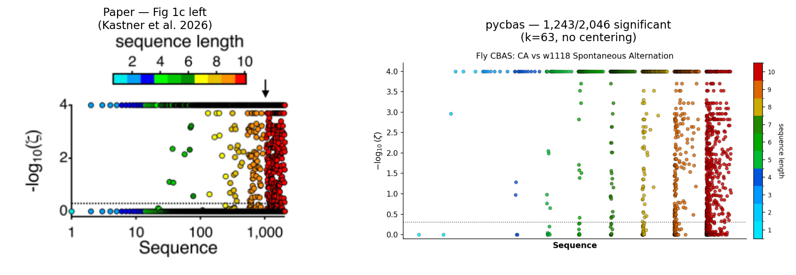
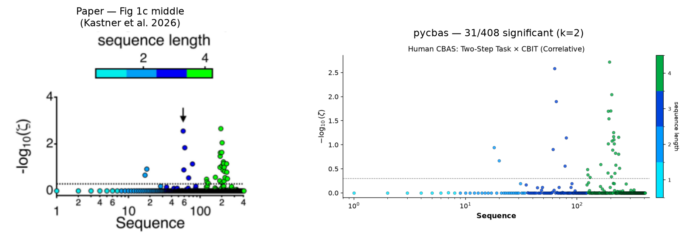
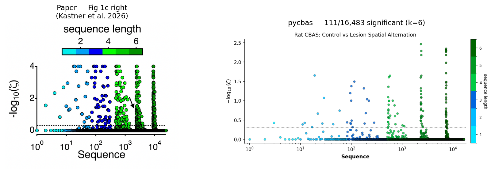

# pycbas — Choice-Wide Behavioral Association Study

Python reimplementation of the [core CBAS algorithm](https://github.com/dbkastner/CBAS) originally written in Igor Pro by David Kastner.

CBAS identifies behavioral sequences that differ significantly between experimental groups (comparative mode) or correlate with a continuous measure (correlative mode). It uses Romano-Wolf step-down for multiple comparison correction and k-FWER iteration for false discovery proportion control.

**Reference:** Kastner et al., "Choice-Wide Behavioral Association Study" [(2026 preprint)](https://www.biorxiv.org/content/10.1101/2024.02.26.582115v4)

### Flies (CA vs w1118 — spontaneous alternation)


### Humans (two-step task — correlative with CBIT)


### Rats (control vs hippocampal lesion — spatial alternation)


## Setup

```bash
git clone https://github.com/droumis/pycbas.git
cd pycbas
pixi install
```

For the rat validation, also clone the original CBAS repo (contains rat data):

```bash
git clone https://github.com/dbkastner/CBAS.git igor_cbas
```

## Usage

```python
from pycbas import CBASParams, load_subject_data, run_cbas_comparative

subjects_data = [load_subject_data(f) for f in data_files]
group_labels = [0, 0, 0, 1, 1, 1]

params = CBASParams(
    num_arms=6,
    seq_len_max=6,
    criterion=800,
    resample_number=10000,
    centering=False,  # default: uncentered null (matches Igor implementation)
)

result = run_cbas_comparative(subjects_data, group_labels, params)
print(f"{result.n_significant} significant sequences (k={result.k_final})")
```

### Bootstrap null centering

The `centering` parameter controls whether the bootstrap null subtracts the observed delta (Clarke et al. 2020 eq 5):

- `centering=False` (default): uncentered null, ~50% fill rate per column. More conservative — matches David Kastner's Igor implementation.
- `centering=True`: centered null, ~5% fill rate. Less conservative — the step-down comparison distribution is weaker because fewer columns contribute to the row max.

```python
params_centered = CBASParams(centering=True)  # more liberal
params_default = CBASParams()                 # conservative (no centering)
```

## Running analyses

Each species has its own analysis script producing `results.json` and figures:

```bash
pixi run flies            # fly spontaneous alternation (CA vs w1118)
pixi run human            # human two-step task (correlative with CBIT)
pixi run rats             # rat spatial alternation (control vs lesion)
```

Quick versions (reduced parameters, ~1-2s each):

```bash
pixi run flies-quick
pixi run human-quick
pixi run rats-quick
```

Regenerate reports from existing results (no recomputation):

```bash
pixi run reports
```

### Timing (full paper-matched parameters, Apple M-series)

| Dataset | Subjects | Sequences | Runtime |
|---|---|---|---|
| Flies | 1,566 | 2,046 | ~28 s |
| Humans | 1,413 | 408 | ~6 s |
| Rats | 85 | 16,483 | ~25 s |

Bootstrap and step-down are parallelized with numba JIT + prange. Set `NUMBA_DISABLE_JIT=1` to disable for debugging.

## Validation results

See the full cross-species summary: [results/validation_summary.md](results/validation_summary.md)

Per-dataset reports with figures:
- [Flies](results/flies/validation_report.md) — 2-arm, seq_len_max=10, M=10,000, 1,566 subjects
- [Humans](results/humans/validation_report.md) — 6-arm, seq_len_max=4, M=10,000, 1,413 subjects (correlative)
- [Rats](results/rats/validation_report.md) — 6-arm, seq_len_max=6, M=10,000, 85 subjects

## Tests

```bash
pixi run test
```
