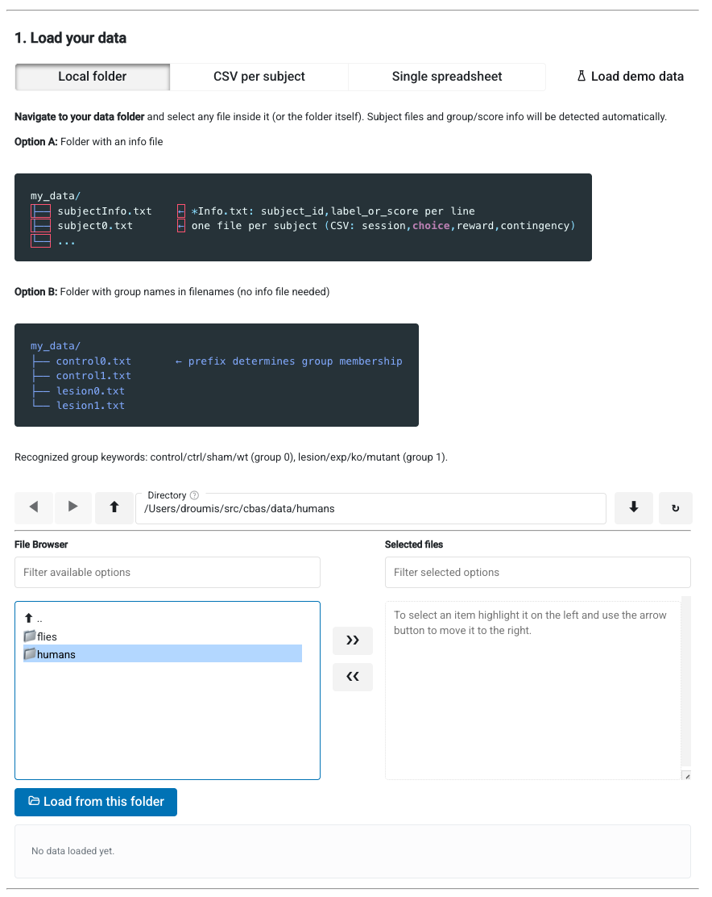
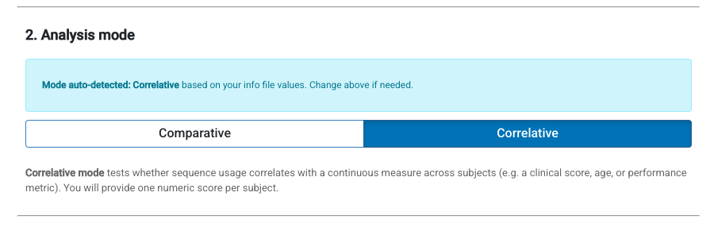
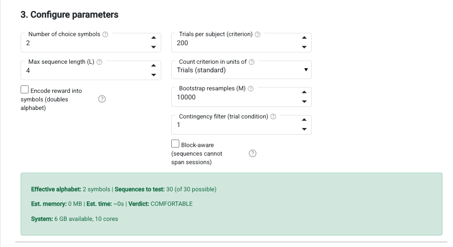
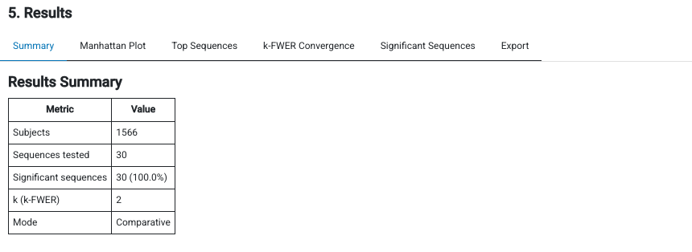
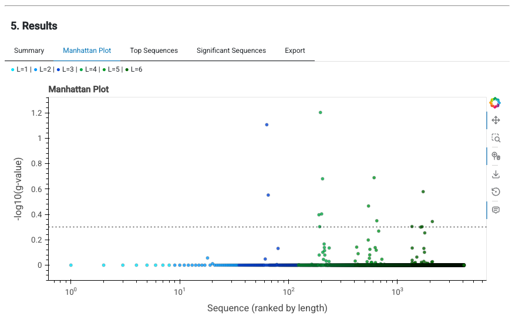
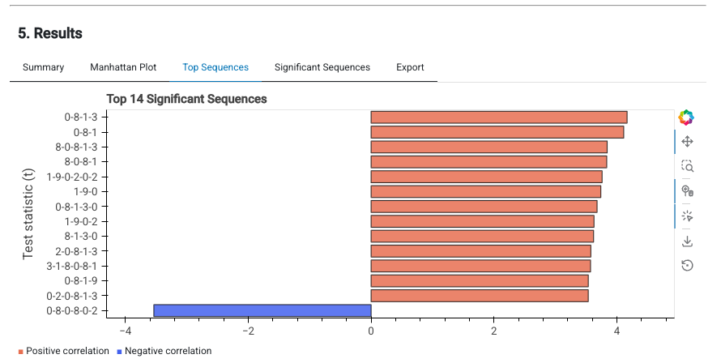
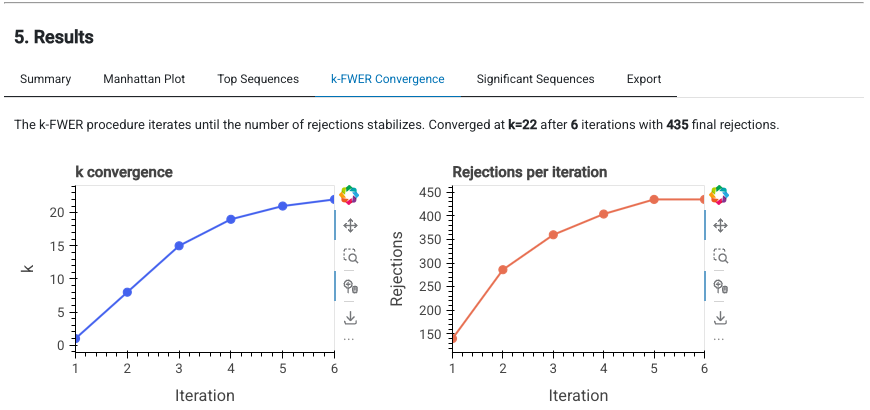

# Interactive GUI

A no-code interface for running CBAS analyses. Load data, configure parameters, run the pipeline, and explore results visually.

## Install and launch

```bash
pip install 'pycbas[gui]'
pycbas gui
```

To use a different port:

```bash
pycbas gui --port 5008
```

### Development install

```bash
git clone https://github.com/droumis/pycbas.git
cd pycbas
pixi run gui          # option 1: pixi
pip install -e '.[gui]' && pycbas gui  # option 2: pip
```

## Workflow

The GUI walks you through the CBAS pipeline in five steps.

### Step 1: Load data

<!-- Screenshot: the data loading step with the folder selector visible -->


Three options for loading data:

**Local folder** (default) — navigate to a folder on disk. The loader auto-detects:

- An `*Info.txt` file (subject_id, label_or_score per line), matching subject data files by trailing ID number
- Or group membership from filename prefixes (e.g. `control0.txt`, `lesion0.txt`). Recognized keywords: control/ctrl/sham/wt (group 0), lesion/exp/ko/mutant (group 1)

**CSV per subject** — upload individual subject files plus a labels/scores file.

**Single spreadsheet** — upload one table with subject, choice, and group/score columns.

### Step 2: Analysis mode

<!-- Screenshot: mode selector showing auto-detected mode alert -->


Mode is auto-detected from the data:

- Binary labels (0/1) → Comparative
- Continuous values → Correlative

You can override the detection if needed.

### Step 3: Configure parameters

<!-- Screenshot: parameter widgets with resource estimate showing observed sequences -->


Parameters are auto-configured from the loaded data:

| Parameter | Auto-detected from |
|---|---|
| Number of arms | Max choice value in data |
| Encode reward | Whether reward column has non-zero values |
| Contingency filter | Distinct contingency values present |
| Criterion | Min trial count per subject (filtered by contingency) |
| Block aware | Multiple sessions/blocks detected in data |

**Max sequence length** and **bootstrap resamples** must be set manually as they depend on the research question.

The resource estimate shows the actual number of observed sequences (not the worst-case theoretical space), estimated memory, runtime, and a verdict based on your system's available RAM.

### Step 4: Run analysis

Click "Run CBAS Analysis" to execute the full pipeline. Progress is shown in real time.

### Step 5: View results

<!-- Screenshot: results tabs showing the Manhattan plot -->


Results are presented across several tabs:

**Summary** — subject count, sequences tested, significant count, k-FWER value, mode.

**Manhattan Plot** — sequences ranked by length on a log x-axis, colored by sequence length. Significant sequences appear above the threshold line.

<!-- Screenshot: Manhattan plot tab -->


**Top Sequences** — horizontal bar chart of the most significant sequences, colored by direction. Shows the test statistic magnitude and which direction the effect goes.

<!-- Screenshot: Top sequences bar chart -->


**k-FWER Convergence** — how k and the number of rejections evolve across iterations until convergence.

<!-- Screenshot: k-convergence plots -->


**Significant Sequences** — sortable, paginated table of all significant sequences with their g-values and directions.

**Export** — download full results or significant-only as CSV.

## Technical notes

- The GUI is a locally-served Panel application. The browser is just a display layer; all computation runs server-side with full access to your system's CPU and RAM.
- The app detects available system memory and CPU cores to inform resource estimates.
- Loading a new dataset clears previous results and resets parameter detection.
- Demo data is available via the "Load demo data" button for testing the interface without real data.
