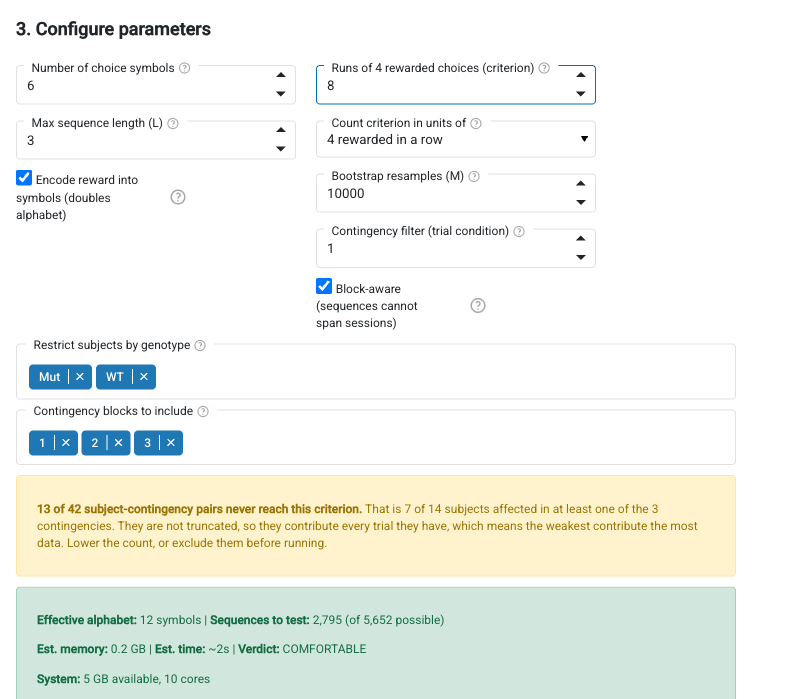

# Interactive GUI

A no-code interface for running CBAS analyses. Load data, configure parameters, run the pipeline, and explore results visually.

## Install and launch

```bash
pip install 'pycbas[gui]'
pycbas gui
```

`python -m pycbas gui` is equivalent, and `pycbas --version` prints the installed
version. There is no analysis subcommand: an analysis is run either from Python, which
[the guide](guide.md) covers, or from this app.

To use a different port:

```bash
pycbas gui --port 5008
```

### Development install

```bash
git clone https://github.com/droumis/pycbas.git
cd pycbas
pixi run gui          # option 1: pixi
pip install -e '.[gui]' && pycbas gui  # option 2: pip
```

## Workflow

The GUI walks you through the CBAS pipeline in five steps.

### Step 1: Load data

<!-- Screenshot: the data loading step with the folder selector visible -->


Three options for loading data:

**Local folder** (default) — navigate to a folder on disk. The loader auto-detects:

- The **multi-contingency format**, whose info table has two header lines and names its
  groups in words. Recognising it switches the app into multi-contingency mode; see
  [Several contingencies](#several-contingencies) below
- An `*Info.txt` file (subject_id, label_or_score per line), matching subject data files by trailing ID number
- Or group membership from filename prefixes (e.g. `control0.txt`, `lesion0.txt`). Recognized keywords: control/ctrl/sham/wt (group 0), lesion/exp/ko/mutant (group 1)

**CSV per subject** — upload individual subject files plus a labels/scores file.

**Single spreadsheet** — upload one table with subject, choice, and group/score columns.

### Step 2: Analysis mode

<!-- Screenshot: mode selector showing auto-detected mode alert -->


Mode is auto-detected from the data:

- Binary labels (0/1) → Comparative
- Continuous values → Correlative

You can override the detection if needed.

### Step 3: Configure parameters

<!-- Screenshot: parameter widgets with resource estimate showing observed sequences -->


Parameters are auto-configured from the loaded data:

| Parameter | Auto-detected from |
|---|---|
| Number of arms | Max choice value in data |
| Encode reward | Whether reward column has non-zero values |
| Contingency filter | Distinct contingency values present |
| Criterion | Min trial count per subject (filtered by contingency), at criterion order 0 only |
| Block aware | Multiple sessions/blocks detected in data |

**Max sequence length** and **bootstrap resamples** must be set manually as they depend on the research question.

The resource estimate shows the number of hypotheses the run will actually test, not
the worst-case theoretical space, along with estimated memory, runtime, and a verdict
based on your system's available RAM. It honours the criterion order, the contingency
filter and the block-aware setting, and for multi-contingency data it honours the
selected blocks, so it moves when you change any of them.

**Count criterion in units of** leaves the criterion as a trial count by default. The
other options stop each subject once it has earned that many rewards, or produced that
many runs of consecutive rewarded choices, which matches subjects on performance rather
than on exposure. Choosing one changes the criterion label and its help text to match, switches its
spinner to single steps since a performance level is usually a much smaller number than
a trial count, skips the auto-detected trial count at load time, and reports how many
subjects fail to reach the criterion along with the spread of trials used. Note that
switching the order after loading does not re-run auto-detection, so an inherited trial
count will be reinterpreted as a performance level: the shortfall report is what catches
that. Subjects that
fall short are not truncated, so they contribute every trial they have. See
[higher-order criteria](guide.md#higher-order-criteria) for the caveats.

<!-- Screenshot: parameters with multi-contingency data loaded, showing the subject
     filter, the contingency block selector and the shortfall report. Synthetic
     cohort. -->


The screenshot above shows the same step with multi-contingency data loaded and a
4th-order criterion selected: the criterion has been relabelled to say what it counts,
the subject filter and block selector have appeared, and the shortfall report is
warning that some subjects never reach the criterion. The cohort is synthetic.

#### Who falls short of the criterion

At any order above 0 the app reports how many subjects never reach the criterion. This
is the most important number on the page and it is easy to misread as a data-quality
note. A subject that falls short is **not** truncated: it contributes every trial it
has, so the subjects performing worst contribute the most data, and if that is uneven
across groups it is a confound rather than a nuisance.

For multi-contingency data the criterion applies within each contingency, so the report
counts subject-contingency pairs and also says how many subjects are affected in at
least one contingency. Counting more contingencies means more chances to fall short.

#### Several contingencies

If the folder holds the multi-contingency format, where each subject's sessions are
divided into contingency blocks, the app detects it on load and adds a **Contingency
blocks to include** selector listing the blocks every subject ran. All of them are
selected by default.

This is not the contingency filter above it, which picks trials by a column value.
Each block selected here is counted as its own set of hypotheses and all of them are
corrected together, so the same arm sequence under two contingencies is two
hypotheses, and adding a block enlarges the hypothesis space rather than splitting the
result. Watch the resource estimate as you change the selection.

Group membership comes from the info table's group column. Subjects whose group field
is blank are skipped, and the load message says how many.

If the info table has a column with a handful of distinct values, such as a genotype or
an experiment number, a **Restrict subjects** selector offers it. Every value is
selected on load, so nothing is dropped unless you ask, and the status line says what
is currently included. Use it where a cohort mixes groups that should not be pooled.

Results are labelled with the block they belong to, as `c3: 2-4-2`.

### Step 4: Run analysis

Click "Run CBAS Analysis" to execute the full pipeline. Progress is shown in real time.

### Step 5: View results

<!-- Screenshot: results tabs showing the Manhattan plot -->


Results are presented across several tabs:

**Summary** — subject count, sequences tested, significant count, k-FWER value, mode.

**Manhattan Plot** — sequences ranked by length on a log x-axis, colored by sequence length. Significant sequences appear above the threshold line.

<!-- Screenshot: Manhattan plot tab -->


**Top Sequences** — horizontal bar chart of the most significant sequences, colored by direction. Shows the test statistic magnitude and which direction the effect goes.

<!-- Screenshot: Top sequences bar chart -->


**k-FWER Convergence** — how k and the number of rejections evolve across iterations until convergence.

<!-- Screenshot: k-convergence plots -->


**Significant Sequences** — sortable, paginated table of all significant sequences with their g-values and directions.

**Export** — download full results or significant-only as CSV.

For multi-contingency runs every sequence label carries the contingency block it belongs
to, as `c3: 2-4-2`, in the plots, the tables and the CSV. The same arm sequence appearing
under two contingencies is two rows, because it is two hypotheses.

One thing the Summary does not say: `alpha` is 0.5, which is not a conventional
threshold. It controls the median false discovery proportion at `gamma`, so the
significant count is not a count of near-certain findings and should be read against a
matched null. See [the algorithm notes](algorithm.md#significance).

## Technical notes

- The GUI is a locally-served Panel application. The browser is just a display layer; all computation runs server-side with full access to your system's CPU and RAM.
- The app detects available system memory and CPU cores to inform resource estimates.
- Loading a new dataset clears previous results and resets parameter detection.
- Demo data is available via the "Load demo data" button for testing the interface without real data.
