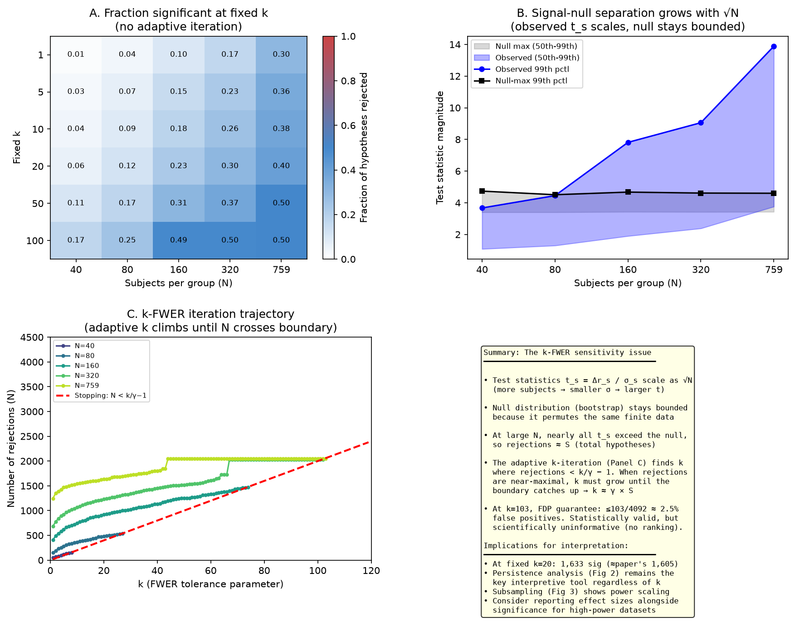
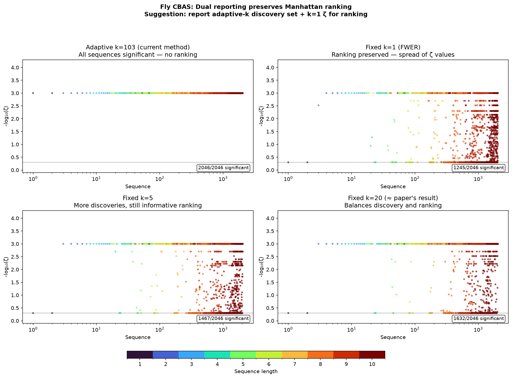
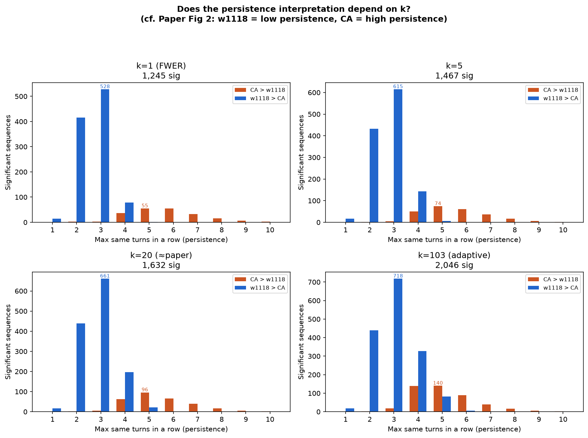

# k-FWER Sensitivity in High-Power Datasets

## The short version

When N is large and the effect is pervasive (like the fly data), the adaptive k-FWER iteration saturates — all sequences come out significant. This isn't a bug. But it means the Manhattan plot can't rank sequences by importance.

**Simple fix:** additionally report ζ at fixed k=1 to preserve ranking.

## What's happening

Test statistics scale as √N (more subjects → smaller σ → larger t_s), but the null stays bounded. At large N, nearly all t_s exceed the null, so rejections ≈ S at every k. The stopping rule (`rejections < k/γ − 1`) forces k to climb until k ≈ γ×S:

    k_final ≈ 0.05 × 2046 ≈ 103

At k=103, the FDP guarantee is ≤2.5% false positives — tighter than γ=5%. Statistically valid, but every sequence is "significant" so you can't rank them.

**Analogy:** It's like running a GWAS with a million subjects — every SNP with a tiny effect hits genome-wide significance. At that point you report effect sizes, not p-values, to rank loci.

## Evidence

| N per group | Adaptive k | Significant | Fraction |
|---|---|---|---|
| 40 | 8 | 155 | 7.6% |
| 80 | 27 | 538 | 26% |
| 160 | 74 | 1,469 | 72% |
| 320 | 102 | 2,029 | 99% |
| 759 (full) | 103 | 2,046 | 100% |

At fixed k=20 with full data: 1,633 significant — matches the paper's 1,605.

## The fix: dual reporting

Run the step-down once more at k=1 on the same null matrix (negligible cost). Use adaptive k for the discovery count, k=1 ζ for the Manhattan ranking:

| k | Significant | Manhattan plot |
|---|---|---|
| 1 (FWER) | 1,245 (61%) | Informative spread |
| 20 | 1,632 (80%) | ≈ paper's result |
| 103 (adaptive) | 2,046 (100%) | Flat ceiling |

The k=1 Manhattan closely resembles the paper's Fig 5c fly panel.

## Persistence interpretation is robust to k

The persistence pattern (w1118 dominates low persistence, CA dominates high persistence) holds at every k. Higher k just admits more marginal sequences on both sides — the overall shape doesn't change.

The structural interpretation doesn't depend on the choice of k. The dual-reporting suggestion is purely about preserving *individual sequence ranking* in the Manhattan plot, not about protecting the aggregate conclusions.
