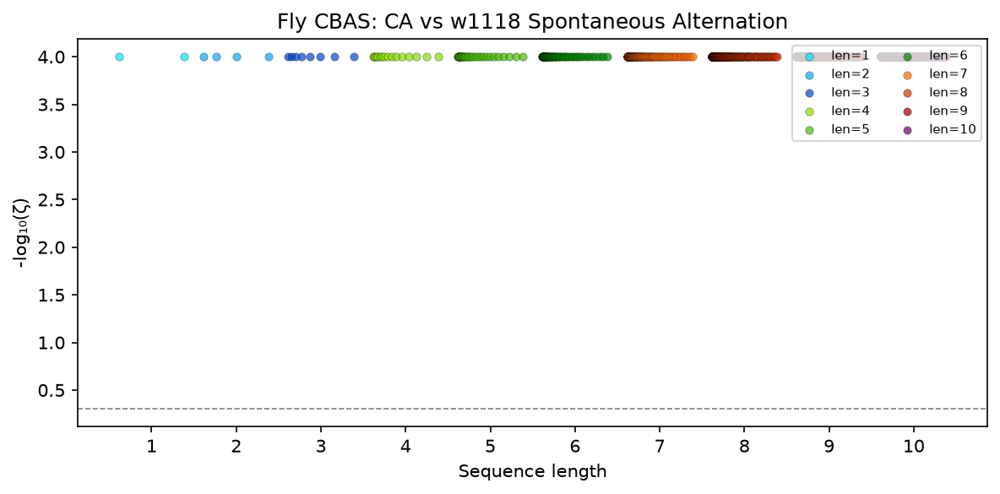
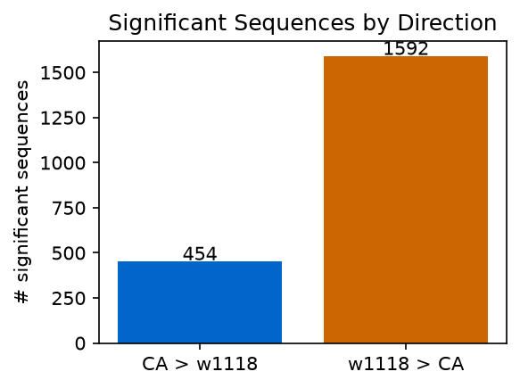
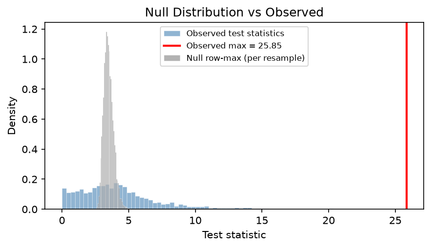
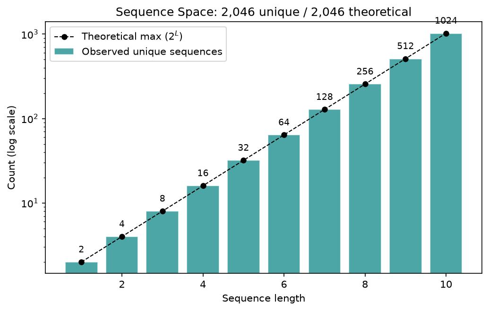
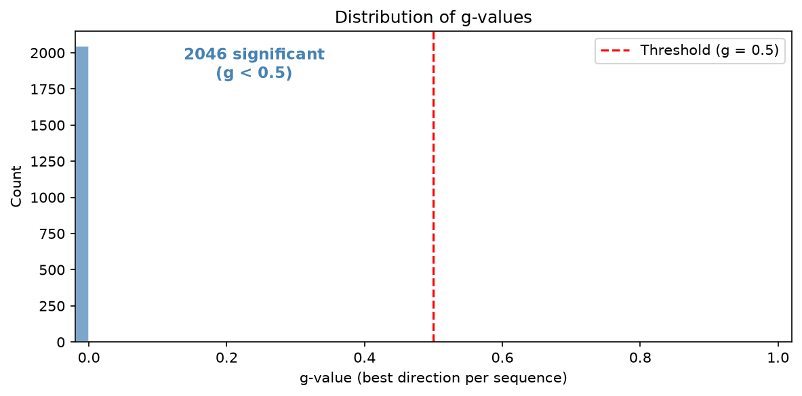

# Fly CBAS Validation Report

## Summary

| | pycbas | Paper (Kastner et al.) |
|---|---|---|
| Flies | 1566 (759 CA, 807 w1118) | 1,566 (759 CA, 807 w1118) |
| Max seq length | 10 | 10 |
| Criterion | 250 | 250 |
| Resamples | 10000 | 10,000 |
| Sequences evaluated | 2,046 | 2,046 |
| Significant | 2046 (100.0%) | 1,605 (78.4%) |
| CA > w1118 | 454 | not separately reported |
| w1118 > CA | 1592 | not separately reported |
| k (k-FWER) | 103 | not reported |
| Runtime | 245.2s | not reported |

## Timing Profile

| Stage | Time (s) | % Total |
|---|---|---|
| build_count_matrix | 2.11 | 0.9% |
| compute_test_stats | 0.01 | 0.0% |
| bootstrap | 9.26 | 3.8% |
| k_fwer | 233.83 | 95.4% |
| **TOTAL** | **245.22** | |

## Figures

### Manhattan Plot

### Significant Sequences by Direction

### Null Distribution vs Observed

### Sequence Space

### g-value Distribution

## Top Significant Sequences

| Sequence | Direction | ζ-value | Decoded |
|---|---|---|---|
| 1 | w1118>CA | 0.0001 | R |
| 0 | CA>w1118 | 0.0001 | L |
| 1-1 | CA>w1118 | 0.0001 | RR |
| 0-0 | CA>w1118 | 0.0001 | LL |
| 0-1 | w1118>CA | 0.0001 | LR |
| 1-0 | w1118>CA | 0.0001 | RL |
| 1-1-1 | CA>w1118 | 0.0001 | RRR |
| 0-0-0 | CA>w1118 | 0.0001 | LLL |
| 1-1-1-1 | CA>w1118 | 0.0001 | RRRR |
| 0-0-0-0 | CA>w1118 | 0.0001 | LLLL |
| 0-1-1 | w1118>CA | 0.0001 | LRR |
| 1-1-0 | w1118>CA | 0.0001 | RRL |
| 1-0-0 | w1118>CA | 0.0001 | RLL |
| 0-0-1 | w1118>CA | 0.0001 | LLR |
| 1-0-1 | w1118>CA | 0.0001 | RLR |
| 0-1-0 | w1118>CA | 0.0001 | LRL |
| 1-1-1-1-1 | CA>w1118 | 0.0001 | RRRRR |
| 0-0-0-0-0 | CA>w1118 | 0.0001 | LLLLL |
| 1-1-1-1-1-1 | CA>w1118 | 0.0001 | RRRRRR |
| 0-1-1-1 | w1118>CA | 0.0001 | LRRR |
| 1-1-1-0 | w1118>CA | 0.0001 | RRRL |
| 0-0-0-0-0-0 | CA>w1118 | 0.0001 | LLLLLL |
| 1-0-0-0 | w1118>CA | 0.0001 | RLLL |
| 0-0-0-1 | w1118>CA | 0.0001 | LLLR |
| 1-1-0-0 | w1118>CA | 0.0001 | RRLL |
