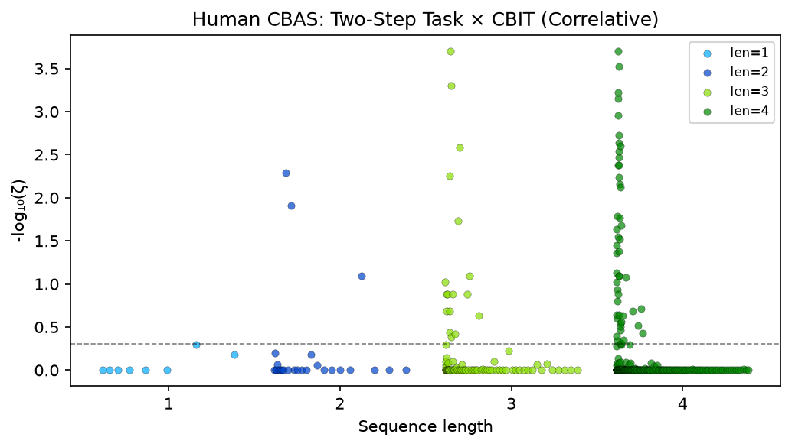
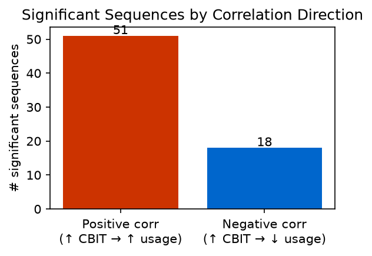
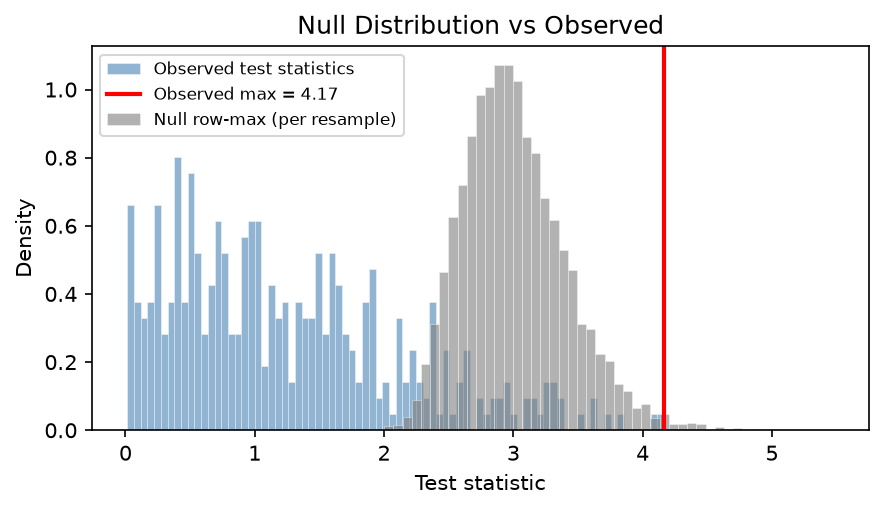
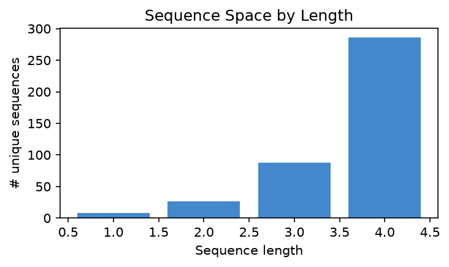
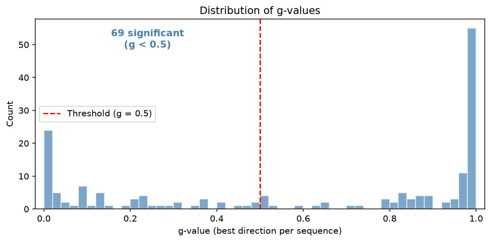

# Human CBAS Validation Report (Correlative Mode)

## Summary

| | pycbas | Paper (Kastner et al.) |
|---|---|---|
| Subjects | 1413 | 1,413 |
| Max seq length | 4 | 4 |
| Criterion | 400 | 400 |
| Resamples | 10000 | 10,000 |
| Sequences evaluated | 408 | 408 |
| Significant | 69 (16.9%) | 31 (7.6%) |
| Positive correlation | 51 | not separately reported |
| Negative correlation | 18 | not separately reported |
| k (k-FWER) | 4 | not reported |
| Runtime | 3.8s | not reported |

## Notes

- **Mode:** Correlative — tests Pearson correlation between each sequence's usage
  count across subjects and each subject's CBIT score (a compulsivity measure).
- **Symbol encoding:** choice + reward × 6. Choices: 0=L1, 1=R1, 2=L2, 3=R2,
  4=no-choice-stage1, 5=no-choice-stage2. UPPERCASE = rewarded.
- **Interpretation:** Positive correlation means higher CBIT (more compulsive)
  subjects use that sequence more. Negative means less.

## Timing Profile

| Stage | Time (s) | % Total |
|---|---|---|
| build_count_matrix | 0.71 | 18.8% |
| compute_test_stats | 0.01 | 0.2% |
| bootstrap | 2.56 | 67.6% |
| k_fwer | 0.50 | 13.3% |
| **TOTAL** | **3.78** | |

## Figures

### Manhattan Plot

### Significant Sequences by Correlation Direction

### Null Distribution vs Observed

### Sequence Space

### g-value Distribution

## Top Significant Sequences

| Sequence | Direction | ζ-value | Decoded |
|---|---|---|---|
| 0-8-1 | + | 0.0002 | L1 L2 R1 |
| 0-8-1-3 | + | 0.0002 | L1 L2 R1 R2 |
| 8-0-8-1 | + | 0.0003 | L2 L1 L2 R1 |
| 1-9-0 | + | 0.0005 | R1 R2 L1 |
| 1-9-0-2 | + | 0.0006 | R1 R2 L1 L2 |
| 8-1-3-0 | + | 0.0007 | L2 R1 R2 L1 |
| 0-8-1-9 | + | 0.0011 | L1 L2 R1 R2 |
| 1-8-0-8 | + | 0.0019 | R1 L2 L1 L2 |
| 3-0-8-1 | + | 0.0023 | R2 L1 L2 R1 |
| 9-0-3-1 | + | 0.0025 | R2 L1 R2 R1 |
| 9-0-3 | + | 0.0026 | R2 L1 R2 |
| 3-1-9-0 | + | 0.0029 | R2 R1 R2 L1 |
| 8-1-9-0 | + | 0.0034 | L2 R1 R2 L1 |
| 1-9-0-8 | + | 0.0042 | R1 R2 L1 L2 |
| 2-0-8-1 | + | 0.0042 | L2 L1 L2 R1 |
| 9-0 | + | 0.0051 | R2 L1 |
| 8-1-3 | + | 0.0056 | L2 R1 R2 |
| 9-0-8-1 | + | 0.0058 | R2 L1 L2 R1 |
| 2-1-9-0 | + | 0.0070 | L2 R1 R2 L1 |
| 1-9-0-3 | + | 0.0075 | R1 R2 L1 R2 |
| 8-1 | + | 0.0122 | L2 R1 |
| 9-1-2-1 | − | 0.0164 | R2 R1 L2 R1 |
| 0-8-1-8 | + | 0.0171 | L1 L2 R1 L2 |
| 1-8-0 | + | 0.0184 | R1 L2 L1 |
| 0-8-1-2 | + | 0.0210 | L1 L2 R1 L2 |
