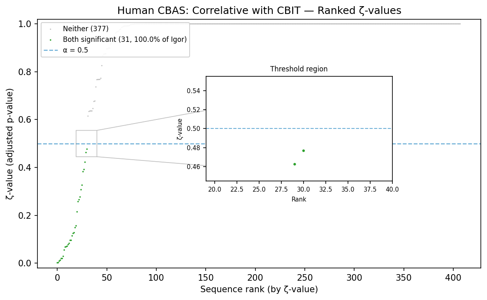
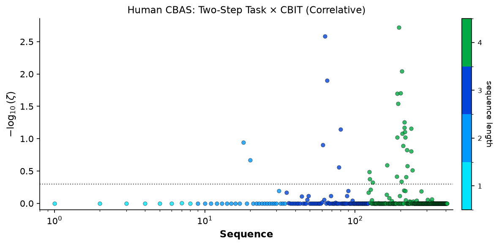
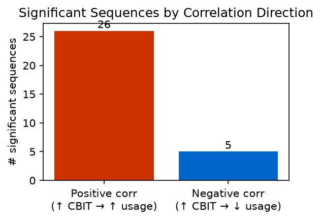
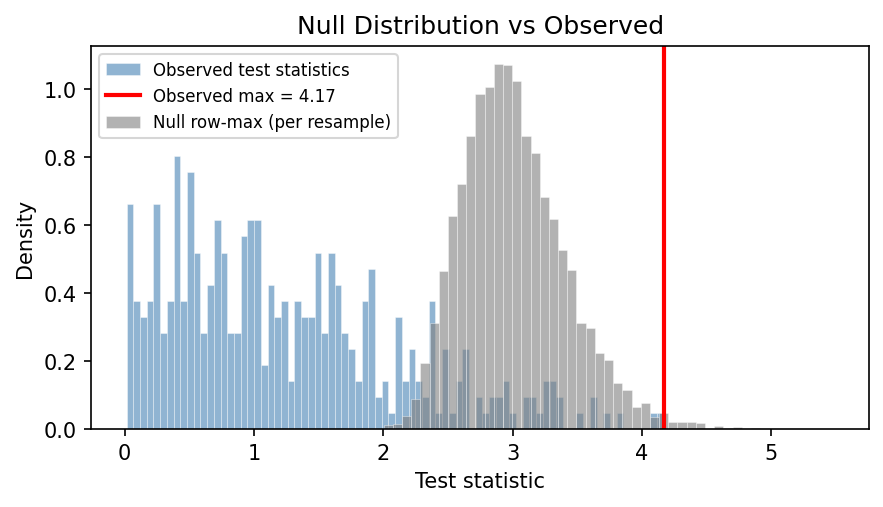
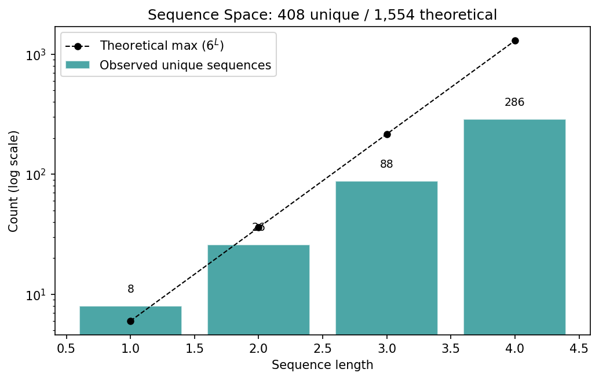
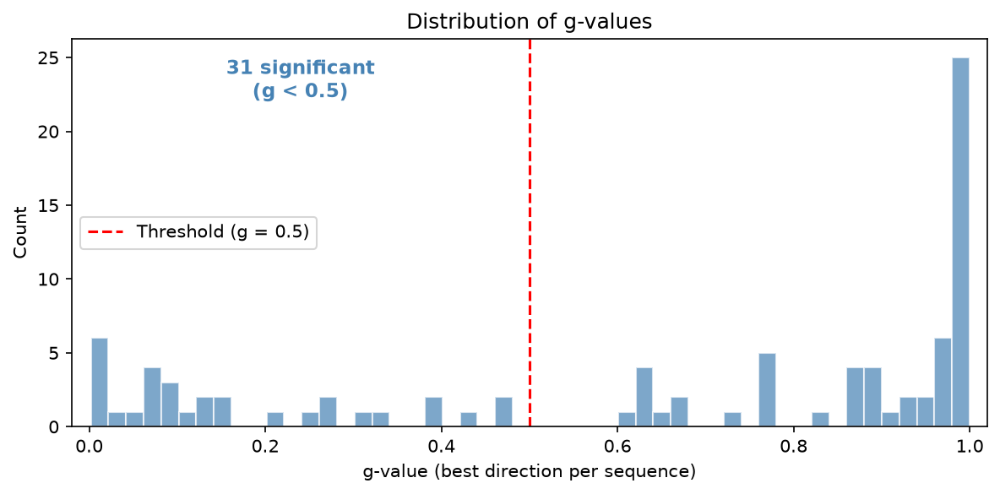

# Human CBAS Validation Report (Correlative Mode)

## Summary

| | pycbas | Paper (Kastner et al.) |
|---|---|---|
| Subjects | 1413 | 1,413 |
| Max seq length | 4 | 4 |
| Criterion | 400 | 400 |
| Resamples | 10000 | 10,000 |
| Sequences evaluated | 408 | 408 |
| Significant | 31 (7.6%) | 31 (7.6%) |
| Positive correlation | 26 | not separately reported |
| Negative correlation | 5 | not separately reported |
| k (k-FWER) | 2 | not reported |
| Runtime | 3.5s | not reported |

## Notes

- **Mode:** Correlative — tests Pearson correlation between each sequence's usage
  count across subjects and each subject's CBIT score (a compulsivity measure).
- **Symbol encoding:** choice + reward × 6. Choices: 0=L1, 1=R1, 2=L2, 3=R2,
  4=no-choice-stage1, 5=no-choice-stage2. UPPERCASE = rewarded.
- **Interpretation:** Positive correlation means higher CBIT (more compulsive)
  subjects use that sequence more. Negative means less.

## Timing Profile

| Stage | Time (s) | % Total |
|---|---|---|
| build_count_matrix | 0.63 | 17.9% |
| compute_test_stats | 0.01 | 0.2% |
| bootstrap | 2.68 | 76.4% |
| k_fwer | 0.19 | 5.5% |
| **TOTAL** | **3.52** | |

## Figures

### Ranked ζ-values (Igor comparison)

### Manhattan Plot

### Significant Sequences by Correlation Direction

### Null Distribution vs Observed

### Sequence Space

### g-value Distribution

## Top Significant Sequences

| Sequence | Direction | ζ-value | Decoded |
|---|---|---|---|
| 0-8-1-3 | + | 0.0019 | L1 L2 R1 R2 |
| 0-8-1 | + | 0.0026 | L1 L2 R1 |
| 8-0-8-1 | + | 0.0090 | L2 L1 L2 R1 |
| 1-9-0 | + | 0.0126 | R1 R2 L1 |
| 1-9-0-2 | + | 0.0198 | R1 R2 L1 L2 |
| 8-1-3-0 | + | 0.0200 | L2 R1 R2 L1 |
| 0-8-1-9 | + | 0.0289 | L1 L2 R1 R2 |
| 1-8-0-8 | + | 0.0553 | R1 L2 L1 L2 |
| 3-0-8-1 | + | 0.0677 | R2 L1 L2 R1 |
| 9-0-3-1 | + | 0.0691 | R2 L1 R2 R1 |
| 9-0-3 | + | 0.0712 | R2 L1 R2 |
| 3-1-9-0 | + | 0.0781 | R2 R1 R2 L1 |
| 8-1-9-0 | + | 0.0831 | L2 R1 R2 L1 |
| 1-9-0-8 | + | 0.0958 | R1 R2 L1 L2 |
| 2-0-8-1 | + | 0.0959 | L2 L1 L2 R1 |
| 9-0 | + | 0.1144 | R2 L1 |
| 8-1-3 | + | 0.1247 | L2 R1 R2 |
| 9-0-8-1 | + | 0.1277 | R2 L1 L2 R1 |
| 2-1-9-0 | + | 0.1489 | L2 R1 R2 L1 |
| 1-9-0-3 | + | 0.1563 | R1 R2 L1 R2 |
| 8-1 | + | 0.2148 | L2 R1 |
| 9-1-2-1 | − | 0.2575 | R2 R1 L2 R1 |
| 0-8-1-8 | + | 0.2655 | L1 L2 R1 L2 |
| 1-8-0 | + | 0.2769 | R1 L2 L1 |
| 0-8-1-2 | + | 0.3073 | L1 L2 R1 L2 |
