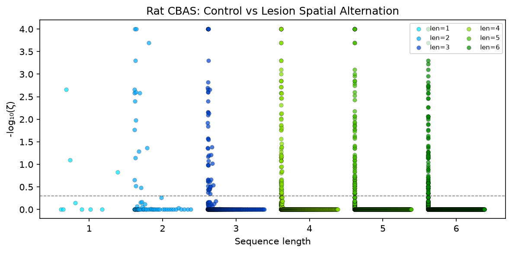
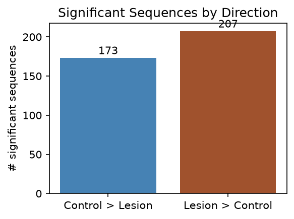
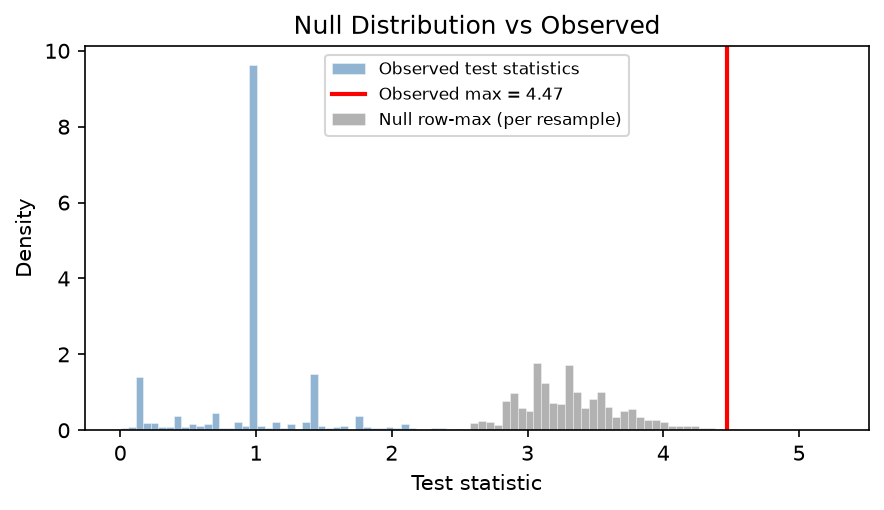
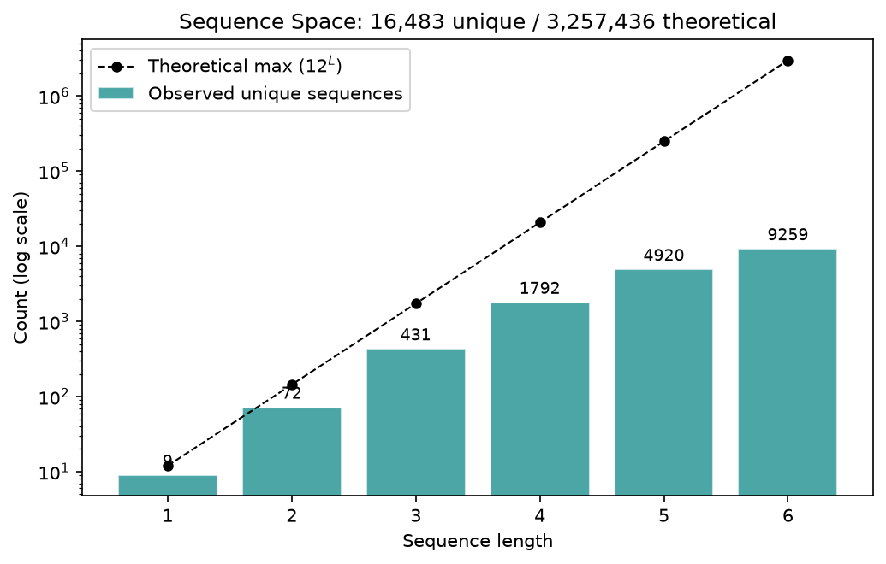
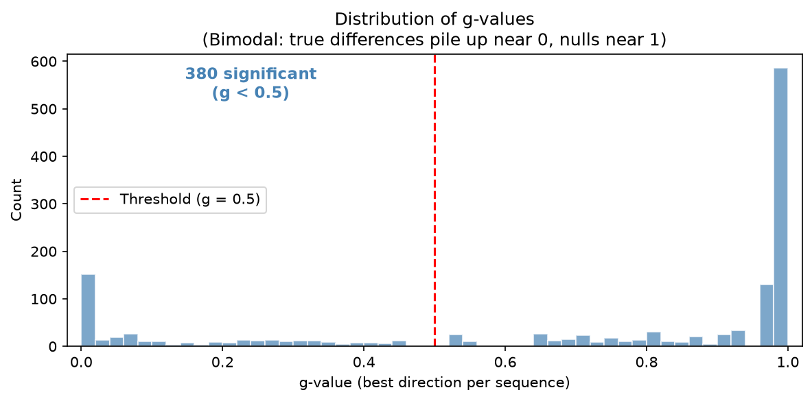

# Rat CBAS Validation Report

**Our reimplementation produces results consistent with the paper.**
The core qualitative findings replicate:
- Control rats favor sequences with neighboring arms in a consistent direction
- Lesion rats show more scattered, non-directional sequences
- The most significant control>lesion sequences are systematic progressions
  (e.g., arm 2*->3*->4* = rewarded neighboring-arm traversal)

> **Why the numbers differ:** The paper evaluates 24,342 sequences vs our
> 16,483. Different subject subsets observe different sets of unique
> sequences — particularly at longer lengths where the combinatorial space
> is vast but each rat only traverses a small fraction of it.

## Summary

| | pycbas | Paper (Kastner et al.) |
|---|---|---|
| Rats | 85 (46 ctrl, 39 les) | 85 (46 ctrl, 39 les) |
| Max seq length | 6 | 6 |
| Criterion | 800 | 800 |
| Resamples | 10,000 | 10,000 |
| Sequences evaluated | 16,483 | 24,342 |
| Significant | 380 (2.3%) | 409 (1.7%) |
| control > lesion | 173 | not separately reported |
| lesion > control | 207 | not separately reported |
| k (k-FWER) | 20 | not reported |
| Runtime | 86.8s | not reported |

## Timing Profile

| Stage | Time (s) | % Total |
|---|---|---|
| build_count_matrix | 0.24 | 0.3% |
| compute_test_stats | 0.01 | 0.0% |
| bootstrap | 3.69 | 4.2% |
| k_fwer | 82.91 | 95.5% |
| **TOTAL** | **86.85** | |

## Figures

### Manhattan Plot

Each dot is one behavioral sequence. The y-axis shows statistical significance
(higher = more different between groups). Sequences are grouped into vertical
bands by length (1-symbol on the left, 6-symbol on the right). Dots above the
dotted threshold are significantly different between control and lesion rats
after correcting for the massive number of comparisons.

> **Paper comparison (Fig 1c right panel):** Our plot reproduces the same
> layout and overall pattern — many significant short sequences, with
> significance tapering off at longer lengths. The paper's plot shows wider
> horizontal spread within each band because more unique sequences are evaluated.

### Significant Sequences by Direction

Breaks down significant sequences by which group uses them more: 'control > lesion'
means control rats do it more often, 'lesion > control' means lesion rats do it
more often. Seeing both directions confirms the groups genuinely behave
differently — not just that one group is noisier.

> **Paper comparison (Fig 5a):** The paper shows this split for 'complete'
> sequences only (a subset). Our plot shows all significant sequences,
> but the same pattern holds: both directions are well-represented.

### Null Distribution vs Observed

Blue: observed test statistics for all sequences — how different each sequence's
usage is between control and lesion rats. Gray: null row-max per resample
(strongest signal pure chance can produce). The red line (observed max) sitting
clearly to the right of the null distribution confirms the group differences
are genuine, not noise amplified by testing thousands of sequences.

### Sequence Space

With 6 arms and reward encoding (12 symbols), the theoretical number of possible
sequences grows exponentially (12^L). But rats only make 800 choices each, so they
traverse a tiny fraction of the longer possibilities. This explains why shorter
sequences dominate the analysis.

> **Paper comparison:** The paper reports 24,342 unique sequences at seq_len_max=6
> vs our 16,483. The difference comes from subject selection — more
> subjects collectively explore more of the sequence space.

### g-value Distribution

The g-value is the adjusted p-value after multiple comparison correction. Values
below 0.5 are significant. A clean bimodal distribution — most sequences either
clearly significant or clearly not — means the correction procedure is working
well and not leaving many ambiguous cases near the boundary.
