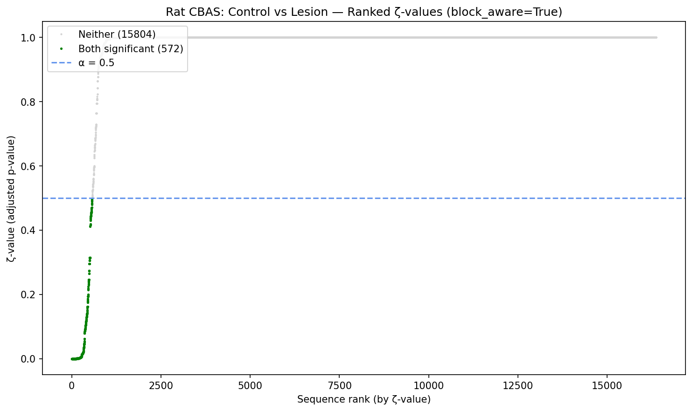

# Rat CBAS Validation Report

## Validation against David's Igor implementation

Test statistics were compared sequence-by-sequence against David's Igor output
(ratTestStats.txt, 16,376 sequences from the all_published cohort). All 16,376
overlapping sequences match within 1e-6 (max difference 2.7e-7). Significance
counts match exactly: 572 significant sequences with k=29, reproducing David's
result with zero discrepancy.

## Results

| Parameter | Value |
|---|---|
| Cohort | all_published (experiments 0-3, genotype 0, lesion known) |
| Subjects | 105 (55 control, 50 lesion) |
| Max sequence length | 6 |
| Criterion | 800 |
| block_aware | True |
| Resamples | 10,000 |
| Sequences evaluated | 16,378 |
| Significant | 572 (3.5%) |
| Control > Lesion | 264 |
| Lesion > Control | 308 |
| k (k-FWER) | 29 |
| Runtime | 11.0s |

## Timing Profile

| Stage | Time (s) | % Total |
|---|---|---|
| build_count_matrix | 0.29 | 2.6% |
| compute_test_stats | 0.01 | 0.1% |
| bootstrap | 4.87 | 44.1% |
| k_fwer | 5.88 | 53.2% |
| **TOTAL** | **11.04** | |

## Figures

### Manhattan Plot

### Significant Sequences by Direction

### Null Distribution vs Observed

### Sequence Space

### g-value Distribution

### Ranked ζ-values (Igor comparison)

## Top Significant Sequences

| Sequence | Direction | ζ-value | Decoded (arm, * = rewarded) |
|---|---|---|---|
| 3 | lesion>control | 0.0001 | 4 |
| 9 | control>lesion | 0.0001 | 4* |
| 8-9 | control>lesion | 0.0001 | 3* 4* |
| 7-8 | control>lesion | 0.0001 | 2* 3* |
| 9-8 | control>lesion | 0.0001 | 4* 3* |
| 8-7-8 | control>lesion | 0.0001 | 3* 2* 3* |
| 0-1 | control>lesion | 0.0001 | 1 2 |
| 7-8-1-8-9 | control>lesion | 0.0001 | 2* 3* 2 3* 4* |
| 8-7-8-1-8-9 | control>lesion | 0.0001 | 3* 2* 3* 2 3* 4* |
| 0-1-8 | control>lesion | 0.0001 | 1 2 3* |
| 7-0-1 | control>lesion | 0.0001 | 2* 1 2 |
| 4-3 | control>lesion | 0.0001 | 5 4 |
| 8-7-0-1 | control>lesion | 0.0001 | 3* 2* 1 2 |
| 0-3 | lesion>control | 0.0001 | 1 4 |
| 7-3 | lesion>control | 0.0001 | 2* 4 |
| 0-1-8-9 | control>lesion | 0.0001 | 1 2 3* 4* |
| 9-4 | control>lesion | 0.0001 | 4* 5 |
| 8-9-4 | control>lesion | 0.0001 | 3* 4* 5 |
| 5-4 | control>lesion | 0.0001 | 6 5 |
| 8-7-3 | lesion>control | 0.0001 | 3* 2* 4 |
| 4-3-8 | control>lesion | 0.0001 | 5 4 3* |
| 7-3-8 | lesion>control | 0.0001 | 2* 4 3* |
| 7-0-1-8 | control>lesion | 0.0001 | 2* 1 2 3* |
| 8-7-3-8 | lesion>control | 0.0001 | 3* 2* 4 3* |
| 8-7-0-1-8 | control>lesion | 0.0001 | 3* 2* 1 2 3* |
