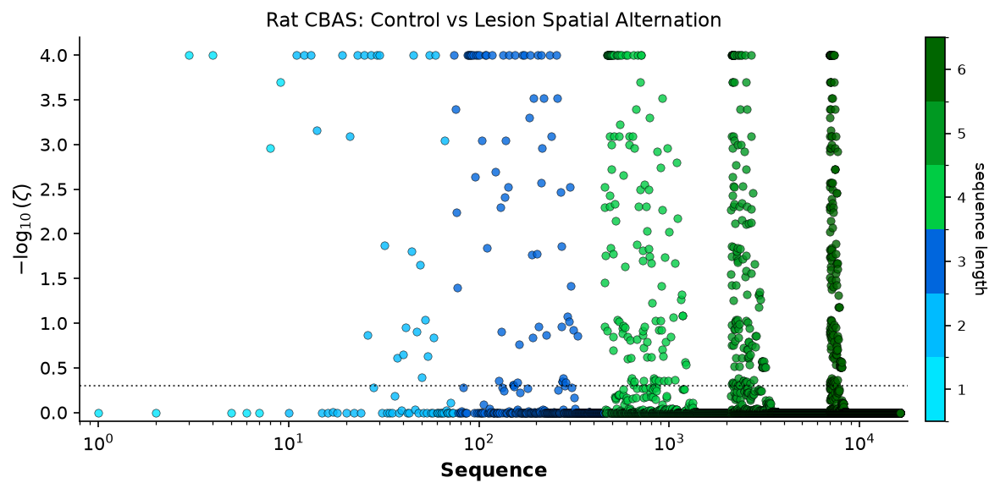
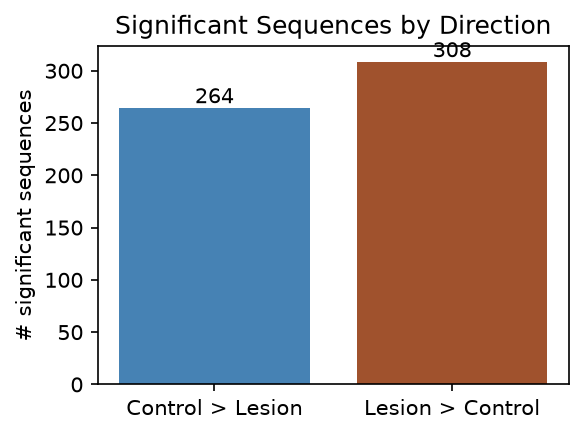
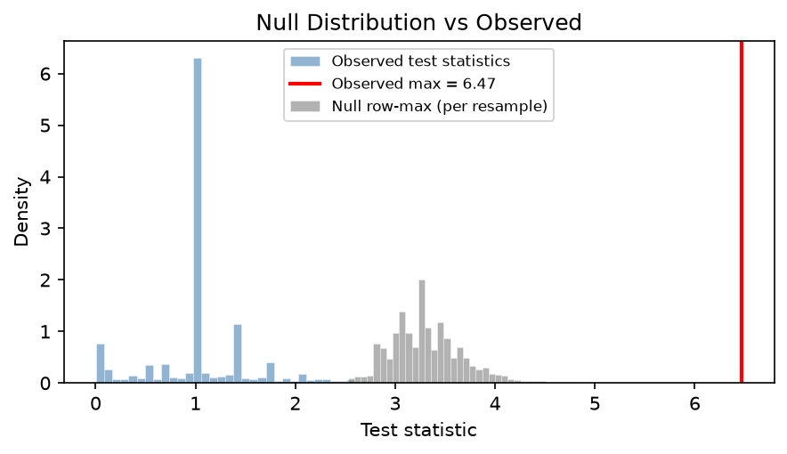
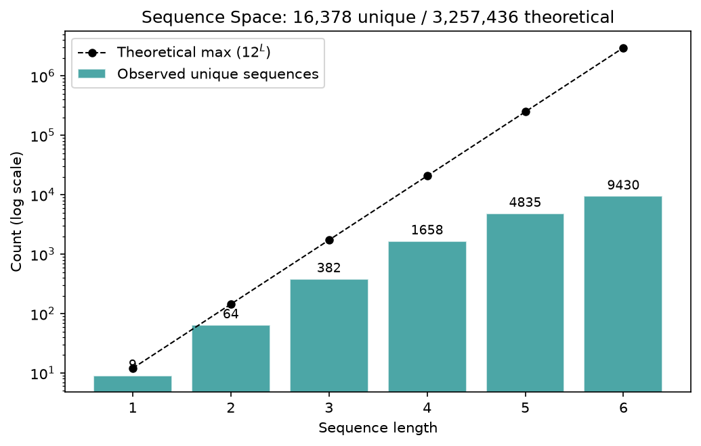
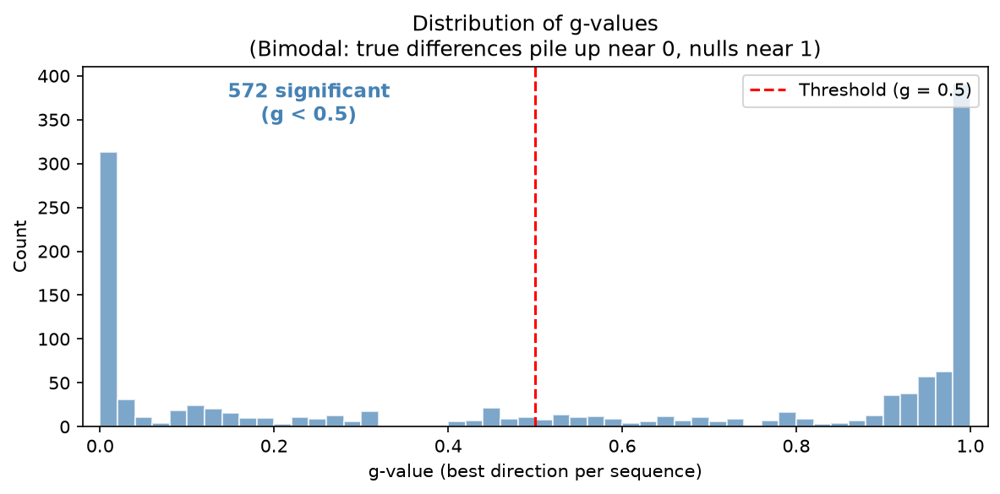

# Rat CBAS Validation Report

## Summary

| | pycbas (85 subjects) | pycbas (111 subjects) | David/Igor (all subjects) |
|---|---|---|---|
| Rats | 85 (46 ctrl, 39 les) | 111 (55 ctrl, 56 les) | more (not all shared) |
| Max seq length | 6 | 6 | 6 |
| Criterion | 800 | 800 | 800 |
| Resamples | 10,000 | 10,000 | 10,000 |
| Sequences evaluated | 16,500 | 19,013 | 24,342 (16,376 in test stats) |
| Significant | 178 (1.1%) | 435 (2.3%) | 572 (2.3%) |
| Control > Lesion | 91 | 215 | 264 |
| Lesion > Control | 87 | 220 | 308 |
| k (k-FWER) | 9 | 22 | 29 |
| Runtime | 8.2s | ~8s | ~3,000s |

## Comparison with David's Igor implementation (111 subjects)

- All 16,376 sequences in David's test stats file are a subset of our 19,013
- Of David's 572 significant sequences, 411 overlap with our 435
- **100% direction agreement** on overlapping significant sequences
- Test statistic Pearson correlation: r=0.93
- Differences due to David having additional subjects not in our dataset, which increases statistical power and pushes more sequences over the significance threshold

### k-iteration comparison

| Iteration | pycbas k | pycbas rejections | David k | David rejections |
|---|---|---|---|---|
| 1 | 1 | 140 | 1 | 203 |
| 2 | 8 | 286 | 11 | 404 |
| 3 | 15 | 360 | 21 | 502 |
| 4 | 19 | 407 | 27 | 554 |
| 5 | 21 | 435 | 28 | 562 |
| 6 | 22 | 435 | 29 | 572 |

## Timing Profile

| Stage | Time (s) | % Total |
|---|---|---|
| build_count_matrix | 0.22 | 2.7% |
| compute_test_stats | 0.00 | 0.1% |
| bootstrap | 3.69 | 45.2% |
| k_fwer | 4.25 | 52.1% |
| **TOTAL** | **8.17** | |

## Figures

### Manhattan Plot

### Significant Sequences by Direction

### Null Distribution vs Observed

### Sequence Space

### g-value Distribution

## Top Significant Sequences

| Sequence | Direction | ζ-value | Decoded (arm, * = rewarded) |
|---|---|---|---|
| 4-3-8-7-8 | control>lesion | 0.0002 | 5 4 3* 2* 3* |
| 4-3-8-7-8-9 | control>lesion | 0.0003 | 5 4 3* 2* 3* 4* |
| 0-1-8-9-8-3 | control>lesion | 0.0003 | 1 2 3* 4* 3* 4 |
| 7-8-9-4-3 | control>lesion | 0.0003 | 2* 3* 4* 5 4 |
| 8-7-8-9-4-3 | control>lesion | 0.0003 | 3* 2* 3* 4* 5 4 |
| 9-4-3-8-7-8 | control>lesion | 0.0003 | 4* 5 4 3* 2* 3* |
| 7-8-9-4-3-8 | control>lesion | 0.0003 | 2* 3* 4* 5 4 3* |
| 7-3-8-3 | lesion>control | 0.0003 | 2* 4 3* 4 |
| 3-8-7-8-9-4 | control>lesion | 0.0003 | 4 3* 2* 3* 4* 5 |
| 8-7-8-1-0-1 | control>lesion | 0.0003 | 3* 2* 3* 2 1 2 |
| 7-8-1-0-1 | control>lesion | 0.0003 | 2* 3* 2 1 2 |
| 0-1 | control>lesion | 0.0004 | 1 2 |
| 8-1-8-1-8-1 | lesion>control | 0.0004 | 3* 2 3* 2 3* 2 |
| 8-9-4-3 | control>lesion | 0.0004 | 3* 4* 5 4 |
| 8-7-3-8-3 | lesion>control | 0.0004 | 3* 2* 4 3* 4 |
| 9-4-3 | control>lesion | 0.0005 | 4* 5 4 |
| 8-3-8-7-3-8 | lesion>control | 0.0005 | 3* 4 3* 2* 4 3* |
| 3-8-7-8-9 | control>lesion | 0.0008 | 4 3* 2* 3* 4* |
| 7-3-8 | lesion>control | 0.0008 | 2* 4 3* |
| 8-7-3-8 | lesion>control | 0.0008 | 3* 2* 4 3* |
| 1-8-9-8-3-4 | control>lesion | 0.0008 | 2 3* 4* 3* 4 5 |
| 8-4-8 | lesion>control | 0.0012 | 3* 5 3* |
| 8-3-8-7-8-9 | control>lesion | 0.0013 | 3* 4 3* 2* 3* 4* |
| 0-1-8-9-8 | control>lesion | 0.0015 | 1 2 3* 4* 3* |
| 7-3-8-7-8 | lesion>control | 0.0015 | 2* 4 3* 2* 3* |
