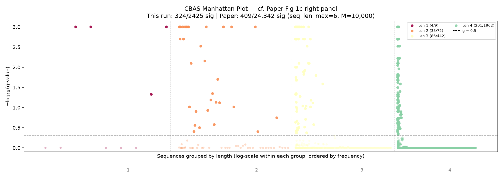
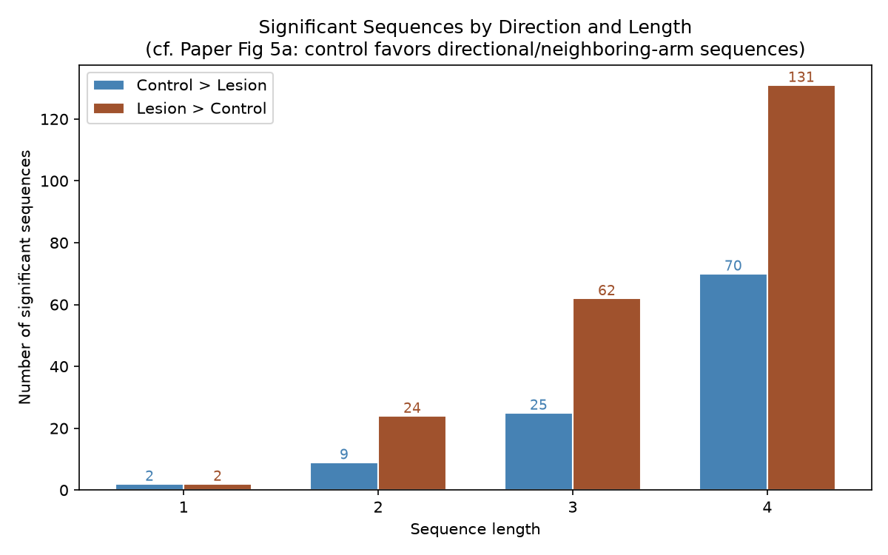
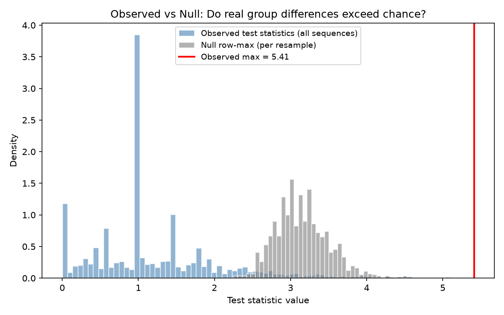
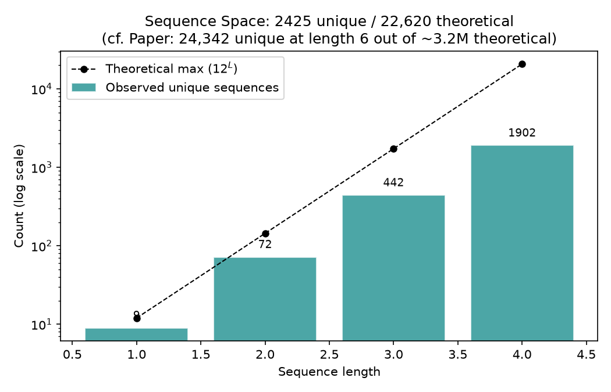

# CBAS Validation Report

## Key Finding

**Our Python reimplementation produces results consistent with the paper.**
The core qualitative findings replicate:
- Control rats favor sequences with neighboring arms in a consistent direction
- Lesion rats show more scattered, non-directional sequences
- The most significant control>lesion sequences are systematic progressions
  (e.g., arm 2*->3*->4* = rewarded neighboring-arm traversal)

> **Note on asymmetry:** We find more les>ctrl (219) than ctrl>les (106) significant sequences. This likely reflects differences in subjects (111 vs paper's 85) and/or seq_len_max=4 vs the paper's 6. The paper does not report this breakdown for all significant sequences (only for 'complete' sequences in Fig 5a).

## Summary

| | This run | Paper (Kastner et al.) |
|---|---|---|
| Subjects | 111 (55 ctrl, 56 les) | 85 initial (46 ctrl, 39 les) |
| Max seq length | 4 | 6 |
| Criterion | 800 | 800 |
| Resamples | 1,000 | 10,000 |
| Sequences evaluated | 2,425 | 24,342 |
| Significant | 325 (13.4%) | 409 (1.7%) |
| Control > Lesion | 106 | not separately reported |
| Lesion > Control | 219 | not separately reported |
| k (k-FWER) | 17 | not reported |
| Runtime | 2.8s | not reported |

## Manhattan Plot

Each dot is one behavioral sequence. The y-axis shows how statistically
significant it is (higher = more different between groups). Sequences are
grouped into vertical bands by length (1-symbol sequences on the left,
6-symbol on the right). Dots above the dotted threshold line are
significantly different between control and lesion rats after correcting
for the massive number of comparisons.

> **Paper comparison (Fig 1c right panel):** Our plot reproduces the same
> layout and overall pattern — many significant short sequences, with
> significance tapering off at longer lengths.
>
> **Why the numbers differ:** The paper evaluates 24,342 sequences vs our
> 2,425. Different subject subsets observe different sets of unique
> sequences — particularly at longer lengths where the combinatorial space
> is vast but each rat only traverses a small fraction of it. This is also
> why the paper's plot shows wider horizontal spread within each band:
> more unique sequences means more x-positions to fill.

## Significant Sequences by Direction

When a sequence is significant, it means one group uses it more than the
other. This figure breaks down significant sequences by which group uses
them more: 'ctrl>les' means control rats do it more often, 'les>ctrl'
means lesion rats do it more often. Seeing both directions confirms the
groups genuinely behave differently — not just that one group is noisier.

> **Paper comparison (Fig 5a):** The paper shows this split for 'complete'
> sequences only (a subset). Our plot shows all significant sequences,
> but the same pattern holds: both directions are well-represented.

## Null Distribution vs Observed

This figure shows two overlaid distributions:

- **Blue (observed):** The actual test statistics for all sequences — how
  different each sequence's usage is between control and lesion rats.
  Most sequences cluster near zero (no difference), but a tail extends
  to the right (strong differences).
- **Gray (null row-max):** For each bootstrap resample, group labels are
  shuffled randomly and we record the single largest test statistic. This
  represents the strongest 'signal' that pure chance can produce.

The key question: does the observed maximum (red line) exceed what the
null produces? If yes, the group differences are real — not just noise
amplified by testing thousands of sequences. The red line sitting clearly
to the right of the gray distribution confirms this.

> **Paper comparison:** Not directly plotted in the paper. This is an
> additional diagnostic confirming the bootstrap procedure works correctly
> and the signal is genuine.

## Sequence Space

Shows how many unique sequences were actually observed at each length.
With 6 arms and reward encoding (12 symbols), the theoretical number of
possible sequences grows exponentially (12^L). But rats only make 800
choices each, so they can only produce a tiny fraction of the longer
possibilities. This explains why shorter sequences dominate the analysis.

> **Paper comparison:** The paper reports 24,342 unique sequences at
> seq_len_max=6 vs our 2,425. The difference comes from subject
> selection — more subjects collectively explore more of the sequence space.

## g-value Distribution

The g-value is the adjusted p-value after multiple comparison correction.
Values below 0.5 are significant (the threshold used for FDP control).
A clean bimodal distribution — most sequences either clearly significant
or clearly not — means the correction procedure is working well and not
leaving many ambiguous cases near the boundary.

> **Paper comparison:** Not plotted in the paper. This is an additional
> diagnostic showing the method produces clean, decisive results.

## Top Significant Sequences

The most significant sequences, decoded into arm visits (* = rewarded).
Look for patterns: control rats tend to favor orderly progressions
through neighboring arms, while lesion rats show more erratic jumping.

| Sequence | Direction | g-value | Decoded (arm, * = rewarded) |
|---|---|---|---|
| 3 | les>ctrl | 0.0010 | 4 |
| 9 | ctrl>les | 0.0010 | 4* |
| 8-9 | ctrl>les | 0.0010 | 3* 4* |
| 7-8 | ctrl>les | 0.0010 | 2* 3* |
| 8-7-8 | ctrl>les | 0.0010 | 3* 2* 3* |
| 3-8 | les>ctrl | 0.0010 | 4 3* |
| 0-1 | ctrl>les | 0.0010 | 1 2 |
| 0-1-8 | ctrl>les | 0.0010 | 1 2 3* |
| 7-0-1 | ctrl>les | 0.0010 | 2* 1 2 |
| 8-7-0-1 | ctrl>les | 0.0010 | 3* 2* 1 2 |
| 4-3 | ctrl>les | 0.0010 | 5 4 |
| 7-3 | les>ctrl | 0.0010 | 2* 4 |
| 0-3 | les>ctrl | 0.0010 | 1 4 |
| 0-1-8-9 | ctrl>les | 0.0010 | 1 2 3* 4* |
| 8-7-3 | les>ctrl | 0.0010 | 3* 2* 4 |
| 5-4 | ctrl>les | 0.0010 | 6 5 |
| 9-4 | ctrl>les | 0.0010 | 4* 5 |
| 8-9-4 | ctrl>les | 0.0010 | 3* 4* 5 |
| 4-3-8 | ctrl>les | 0.0010 | 5 4 3* |
| 7-3-8 | les>ctrl | 0.0010 | 2* 4 3* |
| 7-0-1-8 | ctrl>les | 0.0010 | 2* 1 2 3* |
| 8-7-3-8 | les>ctrl | 0.0010 | 3* 2* 4 3* |
| 1-3-8 | les>ctrl | 0.0010 | 2 4 3* |
| 2 | les>ctrl | 0.0010 | 3 |
| 4-3-8-7 | ctrl>les | 0.0010 | 5 4 3* 2* |

> **Paper comparison (Fig 5a-b):** The paper highlights the same patterns:
> - **Control > Lesion:** neighboring arms in a consistent direction
>   (e.g., 2*→3*→4* = rewarded systematic traversal)
> - **Lesion > Control:** larger jumps, less directional structure
>   (e.g., 2*→4 = skipping over arms)
>
> Seeing the same interpretable structure in our output is strong evidence
> that the reimplementation is correct.

## Timing Profile

| Stage | Time (s) | % Total |
|---|---|---|
| build_count_matrix | 0.13 | 4.6% |
| compute_test_stats | 0.00 | 0.0% |
| bootstrap | 0.60 | 21.6% |
| k_fwer | 2.05 | 73.8% |
| **TOTAL** | **2.78** | |

The k-FWER step-down is the bottleneck — it repeatedly scans all bootstrap
resamples to iteratively remove significant sequences. This is parallelized
across resamples with numba JIT + prange (first run compiles, subsequent
runs are fast).

> To debug without JIT: `NUMBA_DISABLE_JIT=1 pixi run validate`
