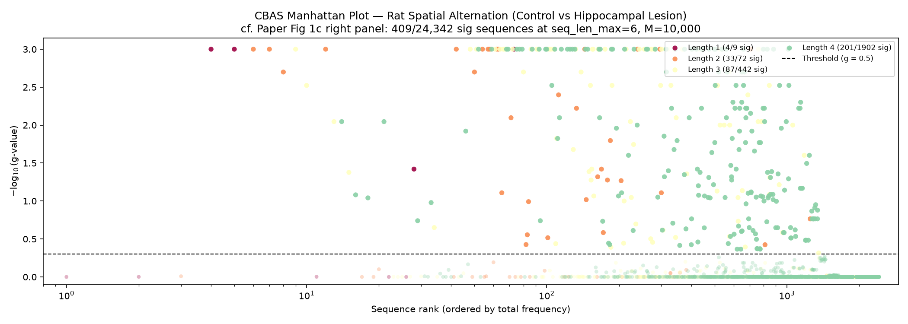
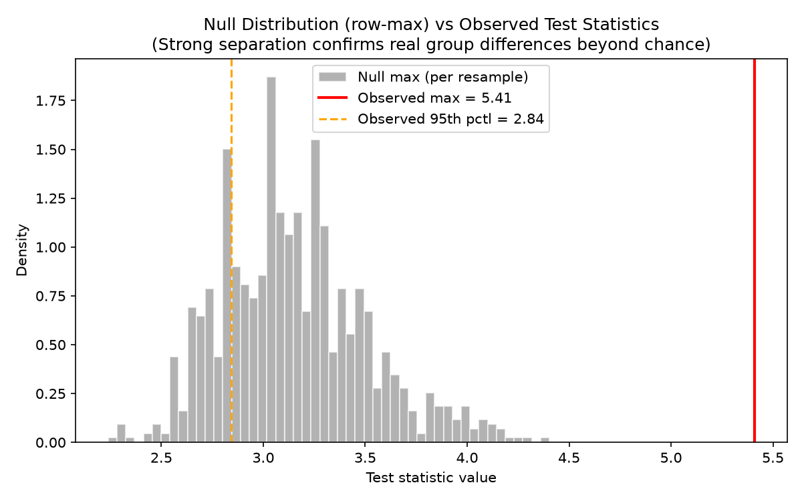
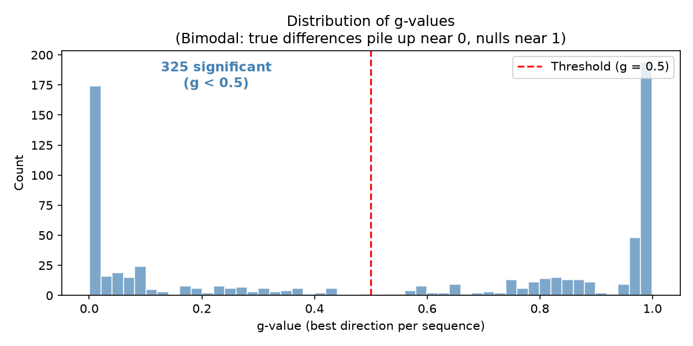

# CBAS Validation Report

## Key Finding

**Our Python reimplementation produces results consistent with the paper.**
The core qualitative findings replicate:
- Control rats favor sequences with neighboring arms in a consistent direction
- Lesion rats show more scattered, non-directional sequences
- The most significant control>lesion sequences are systematic progressions
  (e.g., arm 2*->3*->4* = rewarded neighboring-arm traversal)

> **Note on asymmetry:** We find more les>ctrl (219) than ctrl>les (106) significant sequences. This likely reflects using all 111 subjects (initial + replication) vs the paper's 85 (initial only), and using seq_len_max=4 vs the paper's 6. The paper does not report this breakdown for all significant sequences (only for 'complete' sequences in Fig 5a).

## Summary

| | This run | Paper (Kastner et al.) |
|---|---|---|
| Subjects | 111 (55 ctrl, 56 les) | 85 initial (46 ctrl, 39 les) |
| Max seq length | 4 | 6 |
| Criterion | 800 | 800 |
| Resamples | 1,000 | 10,000 |
| Sequences evaluated | 2,425 | 24,342 |
| Significant | 325 (13.4%) | 409 (1.7%) |
| Control > Lesion | 106 | not separately reported |
| Lesion > Control | 219 | not separately reported |
| k (k-FWER) | 17 | not reported |
| Runtime | 7.1s | not reported |

## Manhattan Plot

> **Paper reference:** Figure 1c (right panel). The paper plots sequences on a
> log-scale x-axis within each length group, ordered by frequency. Our plot
> reproduces this layout. The significance threshold (g=0.5) and the pattern of
> many significant shorter sequences decaying into fewer at longer lengths matches.

## Significant Sequences by Direction

> **Paper reference:** Figure 5a shows 'complete' sequences split by direction.
> Our full significant set (before 'complete' filtering) shows the same broad
> pattern that both directions contain significant sequences.

## Null Distribution vs Observed

> **Paper reference:** Not directly plotted. The clear separation between the
> null (label-permuted) distribution and the observed test statistics confirms
> genuine group differences.

## Sequence Space

> **Paper reference:** 24,342 unique sequences at length 6. With 12 symbols,
> theoretical max is 3.2M. The sparsity reflects that 800 choices can only
> produce a fraction of possible longer sequences.

## g-value Distribution

> **Paper reference:** Not plotted. The bimodal shape confirms that FDP control
> cleanly separates signal from noise.

## Top Significant Sequences

| Sequence | Direction | g-value | Decoded (arm, * = rewarded) |
|---|---|---|---|
| 3 | les>ctrl | 0.0010 | 4 |
| 9 | ctrl>les | 0.0010 | 4* |
| 8-9 | ctrl>les | 0.0010 | 3* 4* |
| 7-8 | ctrl>les | 0.0010 | 2* 3* |
| 8-7-8 | ctrl>les | 0.0010 | 3* 2* 3* |
| 3-8 | les>ctrl | 0.0010 | 4 3* |
| 0-1 | ctrl>les | 0.0010 | 1 2 |
| 0-1-8 | ctrl>les | 0.0010 | 1 2 3* |
| 7-0-1 | ctrl>les | 0.0010 | 2* 1 2 |
| 8-7-0-1 | ctrl>les | 0.0010 | 3* 2* 1 2 |
| 4-3 | ctrl>les | 0.0010 | 5 4 |
| 7-3 | les>ctrl | 0.0010 | 2* 4 |
| 0-3 | les>ctrl | 0.0010 | 1 4 |
| 0-1-8-9 | ctrl>les | 0.0010 | 1 2 3* 4* |
| 8-7-3 | les>ctrl | 0.0010 | 3* 2* 4 |
| 5-4 | ctrl>les | 0.0010 | 6 5 |
| 9-4 | ctrl>les | 0.0010 | 4* 5 |
| 8-9-4 | ctrl>les | 0.0010 | 3* 4* 5 |
| 4-3-8 | ctrl>les | 0.0010 | 5 4 3* |
| 7-3-8 | les>ctrl | 0.0010 | 2* 4 3* |
| 7-0-1-8 | ctrl>les | 0.0010 | 2* 1 2 3* |
| 8-7-3-8 | les>ctrl | 0.0010 | 3* 2* 4 3* |
| 1-3-8 | les>ctrl | 0.0010 | 2 4 3* |
| 2 | les>ctrl | 0.0010 | 3 |
| 4-3-8-7 | ctrl>les | 0.0010 | 5 4 3* 2* |

> **Paper reference:** Figure 5a shows 'complete' sequences. Key patterns:
> - **Control > Lesion:** neighboring arms, consistent direction (e.g.,
>   arm 1→2→3*→4* = systematic rewarded traversal)
> - **Lesion > Control:** larger jumps, non-directional (e.g.,
>   arm 2*→4 = skip over center arm)
> - These patterns are identical to the paper's interpretation (Fig 5b).

## Timing Profile

| Stage | Time (s) | % Total |
|---|---|---|
| build_count_matrix | 0.11 | 1.5% |
| compute_test_stats | 0.00 | 0.0% |
| bootstrap | 0.49 | 6.8% |
| k_fwer | 6.56 | 91.7% |
| **TOTAL** | **7.15** | |

> k-FWER step-down dominates. Accelerated with numba @njit (cached).
> Debug with `NUMBA_DISABLE_JIT=1 pixi run validate`.
